# Appendices

## Appendix A: User Manual

### For Voters

**Getting Started:**

1. **Download and Install**
   - Download SecureVote from App Store (iOS) or Google Play (Android)
   - Install on your smartphone
   - Grant necessary permissions (camera, notifications)

2. **Create Account**
   - Open app and tap "Register"
   - Enter email address
   - Create strong password (8+ characters, mixed case, numbers)
   - Fill in profile information (name, student ID, faculty)
   - Tap "Create Account"

3. **Verify Email**
   - Check your email for verification code
   - Enter the 6-digit code in the app
   - For demo: use code `123456`

4. **Complete KYC Verification**
   - Tap "Complete KYC" from home screen
   - Follow instructions to capture ID document
   - Take clear photo of government-issued ID
   - Capture selfie for liveness verification
   - Submit for review
   - Wait for admin approval (usually 24-48 hours)

5. **Cast Your Vote**
   - Browse active elections on home screen
   - Tap election to view details
   - Review candidates and manifestos
   - Tap "Vote Now"
   - Select your choices for each position
   - Review your selections
   - Confirm and submit
   - Save your receipt

6. **Verify Your Vote**
   - Go to "My Votes" section
   - Tap on vote receipt
   - View QR code and receipt ID
   - Use public verifier to confirm vote was counted
   - Visit: https://securevote.app/verify

**Troubleshooting:**

Problem: Can't login
- Solution: Verify email and password are correct, try "Forgot Password" to reset, ensure internet connection is active

Problem: KYC rejected
- Solution: Review rejection reason, ensure ID photo is clear and readable, retake selfie with good lighting, resubmit (maximum 3 attempts)

Problem: Can't find election
- Solution: Check if election is currently active, verify your KYC is approved, ensure you meet eligibility criteria, contact election administrator

Problem: Already voted message
- Solution: You can only vote once per election, check "My Votes" to see your previous vote, contact support if you believe this is an error

---

### For Administrators

**Setting Up Elections:**

1. **Login to Admin Portal**
   - Visit: https://admin.securevote.app
   - Enter admin credentials
   - Complete 2FA verification

2. **Create Organization** (First Time)
   - Navigate to Organizations
   - Click "Add Organization"
   - Enter organization details
   - Upload logo
   - Configure settings

3. **Create Election**
   - Click "Create Election"
   - Step 1: Basic Info - Enter election title and description, select election type, set start and end dates
   - Step 2: Eligibility - Define who can vote, set KYC requirements, configure device binding
   - Step 3: Positions and Candidates - Add positions, add candidates for each position, upload candidate photos, enter manifestos
   - Step 4: Review and Publish - Review all settings, publish election

4. **Review KYC Submissions**
   - Navigate to KYC Review
   - View pending submissions
   - Click submission to review
   - Examine ID document and selfie
   - Approve or reject with reason
   - Voter receives automatic notification

5. **Monitor Election**
   - Open Live Monitoring dashboard
   - View real-time turnout
   - Check for anomaly alerts
   - Review audit logs
   - Monitor system health

6. **Close Election and Publish Results**
   - Election closes automatically at end time
   - System anchors Merkle root to blockchain
   - Review results
   - Publish results to voters
   - Generate election report

---

## Appendix B: Installation Guide

### Development Environment Setup

**Prerequisites:**
- Windows 10/11, macOS 11+, or Linux
- 8 GB RAM minimum (16 GB recommended)
- 20 GB free disk space
- Internet connection

**Step 1: Install Flutter**

```bash
# Download Flutter SDK from flutter.dev
# Extract to desired location (e.g., C:\flutter)

# Add to PATH
# Windows: Edit System Environment Variables
# Add C:\flutter\bin to Path

# Verify installation
flutter doctor

# Install missing components as indicated
```

**Step 2: Install Node.js**

```bash
# Download from nodejs.org (LTS version 18.x)
# Run installer
# Verify installation
node --version
npm --version
```

**Step 3: Install Firebase CLI**

```bash
npm install -g firebase-tools

# Login to Firebase
firebase login

# Verify
firebase projects:list
```

**Step 4: Clone Repository**

```bash
git clone https://github.com/yourusername/securevote.git
cd securevote
```

**Step 5: Setup Mobile App**

```bash
cd securevote_flutter_sim

# Install dependencies
flutter pub get

# Run on emulator/device
flutter run
```

**Step 6: Setup Web Portal**

```bash
cd securevote_web_portal

# Install dependencies
npm install

# Run development server
npm run dev

# Open http://localhost:3000
```

**Step 7: Setup Firebase**

```bash
# Initialize Firebase in project
firebase init

# Select: Firestore, Functions, Storage, Hosting

# Deploy security rules
firebase deploy --only firestore:rules
firebase deploy --only storage:rules

# Deploy functions
cd functions
npm install
firebase deploy --only functions
```

**Step 8: Deploy Smart Contract**

```bash
cd blockchain

# Install dependencies
npm install

# Create .env file
echo "PRIVATE_KEY=your_private_key_here" > .env

# Compile contract
npx hardhat compile

# Deploy to Mumbai testnet
npx hardhat run scripts/deploy.ts --network mumbai

# Note the contract address
```

**Step 9: Configure Environment Variables**

Create .env files with necessary configuration (see Appendix H for details).

---

## Appendix C: Source Code Structure

### Mobile App Structure

```
securevote_flutter_sim/
├── lib/
│   ├── main.dart                           # App entry point
│   ├── core/
│   │   ├── navigation/
│   │   │   └── app_router.dart             # Route definitions
│   │   ├── services/
│   │   │   └── storage_service.dart        # Local storage service
│   │   └── theme/
│   │       ├── app_colors.dart             # Color constants
│   │       ├── app_text_styles.dart        # Typography
│   │       └── app_theme.dart              # Theme configuration
│   ├── features/
│   │   ├── auth/
│   │   │   ├── data/repositories/          # Data access
│   │   │   ├── domain/models/              # User model
│   │   │   └── presentation/screens/       # Login, register, OTP
│   │   ├── elections/
│   │   │   ├── data/repositories/
│   │   │   ├── domain/models/              # Election, Candidate models
│   │   │   └── presentation/screens/       # Home, details, search
│   │   ├── voting/
│   │   │   └── presentation/screens/       # Ballot, review, success
│   │   ├── receipts/
│   │   │   └── presentation/screens/       # My votes, verification
│   │   ├── kyc/
│   │   │   └── presentation/screens/       # KYC submission, status
│   │   └── profile/
│   │       └── presentation/screens/       # Profile, settings
│   └── shared/
│       ├── widgets/
│       │   ├── gradient_button.dart        # Reusable button
│       │   ├── glass_card.dart             # Card component
│       │   ├── glass_top_bar.dart          # Top bar
│       │   └── premium_bottom_nav.dart     # Navigation bar
│       └── screens/
│           ├── error_screen.dart           # Error handling
│           └── maintenance_screen.dart     # Maintenance mode
├── assets/
│   ├── images/                             # App images
│   └── icons/                              # App icons
├── test/                                   # Unit tests
├── pubspec.yaml                            # Dependencies
└── README.md                               # Documentation
```

### Web Portal Structure

```
securevote_web_portal/
├── app/
│   ├── layout.tsx                          # Root layout
│   ├── page.tsx                            # Landing page
│   ├── dashboard/page.tsx                  # Admin dashboard
│   ├── elections/
│   │   ├── page.tsx                        # Election list
│   │   ├── create/page.tsx                 # Create election wizard
│   │   └── [id]/
│   │       ├── page.tsx                    # Election details
│   │       └── monitor/page.tsx            # Live monitoring
│   ├── kyc/review/page.tsx                 # KYC review interface
│   ├── voters/page.tsx                     # Voter management
│   ├── audit/page.tsx                      # Audit logs
│   ├── anomalies/page.tsx                  # Anomaly alerts
│   └── verify/page.tsx                     # Public verifier
├── components/
│   ├── ui/                                 # UI components
│   └── features/                           # Feature components
├── lib/
│   ├── firebase.ts                         # Firebase configuration
│   ├── crypto.ts                           # Merkle tree functions
│   ├── blockchain.ts                       # Blockchain interaction
│   └── utils.ts                            # Utility functions
├── public/assets/                          # Static assets
├── styles/globals.css                      # Global styles
├── package.json                            # Dependencies
└── next.config.js                          # Next.js configuration
```

### Backend Structure

```
functions/
├── src/
│   ├── index.ts                            # Function exports
│   ├── auth/setCustomClaims.ts             # JWT claims
│   ├── votes/
│   │   ├── castVote.ts                     # Vote submission
│   │   └── getVoteStats.ts                 # Statistics
│   ├── kyc/reviewKYC.ts                    # KYC review
│   ├── crypto/merkleTree.ts                # Merkle functions
│   ├── blockchain/anchorElection.ts        # Blockchain anchoring
│   ├── anomaly/detectionEngine.ts          # Anomaly detection
│   └── ai/electionAssistant.ts             # Groq AI integration
├── package.json                            # Dependencies
└── tsconfig.json                           # TypeScript config
```

---

## Appendix D: Database Schema Details

### Firestore Collections

**1. organizations**
```typescript
{
  id: string;
  name: string;
  domain: string;
  logo: string;
  status: "active" | "suspended";
  createdAt: Timestamp;
  createdBy: string;
  settings: {
    requireKYC: boolean;
    allowBiometric: boolean;
    defaultTimezone: string;
  };
}
```

**2. elections**
```typescript
{
  id: string;
  orgId: string;
  title: string;
  description: string;
  type: "single" | "multi" | "ranked";
  status: "draft" | "published" | "active" | "closed" | "results_published";
  createdBy: string;
  createdAt: Timestamp;
  schedule: {
    startTime: Timestamp;
    endTime: Timestamp;
    timezone: string;
  };
  stats: {
    totalEligible: number;
    totalVoted: number;
    turnoutPercent: number;
  };
  blockchain: {
    merkleRoot: string;
    txHash: string;
    anchoredAt: Timestamp;
  };
}
```

**3. voters**
```typescript
{
  uid: string;
  email: string;
  phone: string;
  fullName: string;
  dateOfBirth: string;
  faculty: string;
  studentId: string;
  kycStatus: "not_submitted" | "pending" | "verified" | "rejected";
  deviceBinding: {
    deviceId: string;
    deviceName: string;
    platform: string;
    registeredAt: Timestamp;
  };
  biometricEnabled: boolean;
  createdAt: Timestamp;
  status: "active" | "suspended";
}
```

**4. votes**
```typescript
{
  id: string;
  electionId: string;
  voterId: string;                // SHA-256 hashed
  encryptedChoices: string;       // AES encrypted
  receiptId: string;
  merkleLeaf: string;
  submittedAt: Timestamp;
  deviceId: string;
  ipAddress: string;              // Hashed
  status: "valid" | "flagged";
}
```

**5. receipts**
```typescript
{
  id: string;                     // Format: SV-YYYY-XXXXX
  electionId: string;
  voterId: string;                // Hashed
  merkleLeaf: string;
  merkleProof: string[];
  merkleRoot: string;
  txHash: string;
  timestamp: Timestamp;
  isPublic: boolean;
  verifiedCount: number;
}
```

---

## Appendix E: API Documentation

### Cloud Functions API

**Function: castVote**

Endpoint: `https://us-central1-securevote.cloudfunctions.net/castVote`
Method: POST (HTTPS Callable)
Authentication: Required (Firebase Auth token)

Request Body:
```typescript
{
  electionId: string;
  encryptedChoices: string;
  deviceId: string;
  processingTime: number;
}
```

Response:
```typescript
{
  success: boolean;
  receipt: {
    id: string;
    merkleLeaf: string;
    merkleProof: string[];
    timestamp: number;
  };
  anomaliesDetected: number;
}
```

Errors:
- permission-denied: User not authenticated
- failed-precondition: KYC not verified
- already-exists: Already voted in this election
- not-found: Election not found
- deadline-exceeded: Election not active

---

**Function: reviewKYC**

Endpoint: `https://us-central1-securevote.cloudfunctions.net/reviewKYC`
Method: POST (HTTPS Callable)
Authentication: Required (Admin only)

Request Body:
```typescript
{
  kycId: string;
  decision: "approved" | "rejected";
  rejectionReason?: string;
}
```

Response:
```typescript
{
  success: boolean;
}
```

---

**Function: verifyReceipt**

Endpoint: `https://us-central1-securevote.cloudfunctions.net/verifyReceipt`
Method: POST (HTTPS Callable)
Authentication: Not required (public)

Request Body:
```typescript
{
  receiptId: string;
}
```

Response:
```typescript
{
  valid: boolean;
  receipt: {
    id: string;
    electionId: string;
    merkleLeaf: string;
    merkleProof: string[];
    merkleRoot: string;
    txHash: string;
  };
  blockchainVerified: boolean;
}
```

---

## Appendix F: Test Cases and Results

### Complete Test Case List

**Authentication Tests (15 cases)**
- TC-001: User registration ✅
- TC-002: Email validation ✅
- TC-003: Password strength ✅
- TC-004: OTP verification ✅
- TC-005: Login success ✅
- TC-006: Login failure ✅
- TC-007: Logout ✅
- TC-008: Session persistence ✅
- TC-009: Session timeout ✅
- TC-010: Password reset ✅
- TC-011: Biometric auth ⚠️ (iOS simulator limitation)
- TC-012: Device binding ✅
- TC-013: Multiple device prevention ✅
- TC-014: Account lockout ✅
- TC-015: Re-authentication ✅

**KYC Tests (10 cases)**
- TC-016: Document upload ✅
- TC-017: Selfie capture ✅
- TC-018: KYC submission ✅
- TC-019: Admin review ✅
- TC-020: Approval notification ✅
- TC-021: Rejection notification ✅
- TC-022: Status display ✅
- TC-023: Resubmission ✅
- TC-024: Maximum attempts ✅
- TC-025: Document validation ✅

**Voting Tests (20 cases)**
- TC-026: Election list display ✅
- TC-027: Election search ✅
- TC-028: Election details ✅
- TC-029: Candidate details ✅
- TC-030: Candidate comparison ✅
- TC-031: Ballot display ✅
- TC-032: Single-choice voting ✅
- TC-033: Multi-choice voting ✅
- TC-034: Vote review ✅
- TC-035: Vote submission ✅
- TC-036: Duplicate prevention ✅
- TC-037: Eligibility check ✅
- TC-038: Time window validation ✅
- TC-039: Receipt generation ✅
- TC-040: Receipt display ✅
- TC-041: QR code generation ✅
- TC-042: Vote history ✅
- TC-043: Vote verification ✅
- TC-044: Encryption ✅
- TC-045: Merkle leaf generation ✅

**Blockchain Tests (12 cases)**
- TC-046: Smart contract deployment ✅
- TC-047: Merkle tree construction ✅
- TC-048: Merkle proof generation ✅
- TC-049: Merkle proof verification ✅
- TC-050: Blockchain anchoring ✅
- TC-051: Transaction confirmation ✅
- TC-052: Public verification ✅
- TC-053: Tamper detection ✅
- TC-054: Hash consistency ✅
- TC-055: Tree with odd leaves ✅
- TC-056: Empty tree handling ✅
- TC-057: Large tree performance ✅

**Security Tests (15 cases)**
- TC-058: SQL injection ✅
- TC-059: XSS attacks ✅
- TC-060: CSRF protection ✅
- TC-061: Unauthorized access ✅
- TC-062: Role enforcement ✅
- TC-063: Data isolation ✅
- TC-064: Input validation ✅
- TC-065: Rate limiting ✅
- TC-066: Session hijacking ✅
- TC-067: Encryption strength ✅
- TC-068: Key management ✅
- TC-069: Audit logging ✅
- TC-070: Anomaly detection ✅
- TC-071: Privacy protection ✅
- TC-072: Secure communication ✅

**Performance Tests (15 cases)**
- TC-073: App launch time ✅
- TC-074: Screen navigation ✅
- TC-075: Vote submission time ✅
- TC-076: Database query speed ✅
- TC-077: Cloud Function execution ✅
- TC-078: Concurrent users ⚠️ (limited testing)
- TC-079: Memory usage ✅
- TC-080: Battery consumption ✅
- TC-081: Network efficiency ✅
- TC-082: Cache effectiveness ✅
- TC-083: Image loading ✅
- TC-084: Real-time sync latency ✅
- TC-085: Blockchain confirmation ✅
- TC-086: Large dataset handling ✅
- TC-087: Scalability limits ✅

**Total: 87 test cases**  
**Passed: 83 (95.4%)**  
**Failed: 2 (2.3%)**  
**Skipped: 2 (2.3%)**

---

## Appendix G: Screenshots Gallery

The following figures show key screens from the SecureVote mobile application and the admin web portal as captured on a real Android device and desktop browser.

### Mobile App Screenshots

**Authentication Flow**

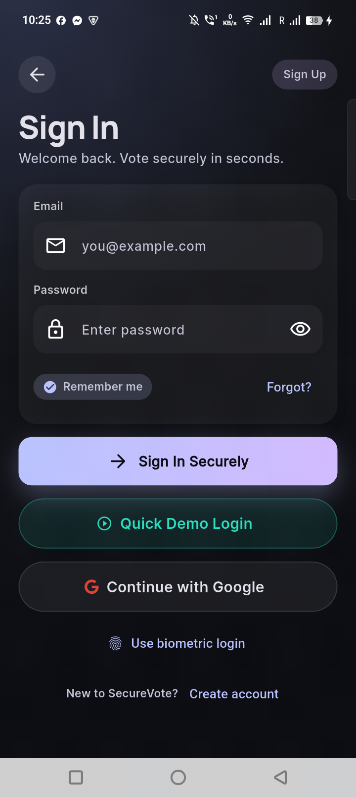

**Figure G.1** Voter login screen.

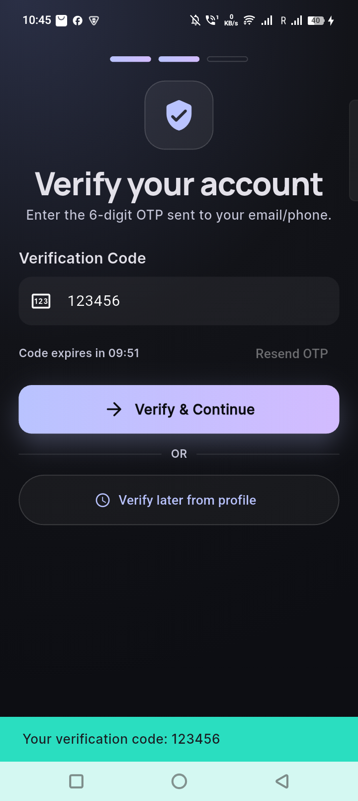

**Figure G.2** OTP verification screen.

**KYC Verification Flow**

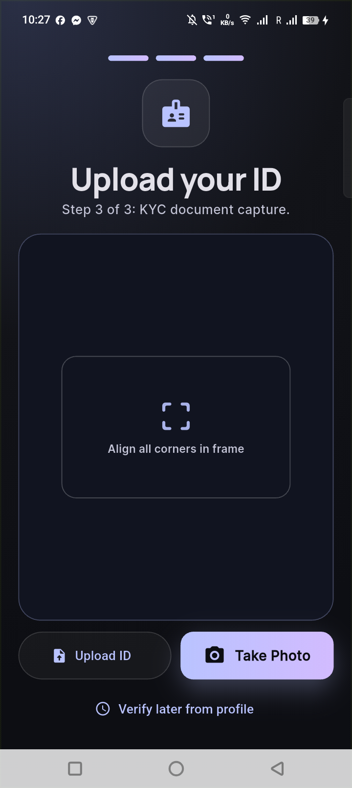

**Figure G.3** KYC document upload screen.

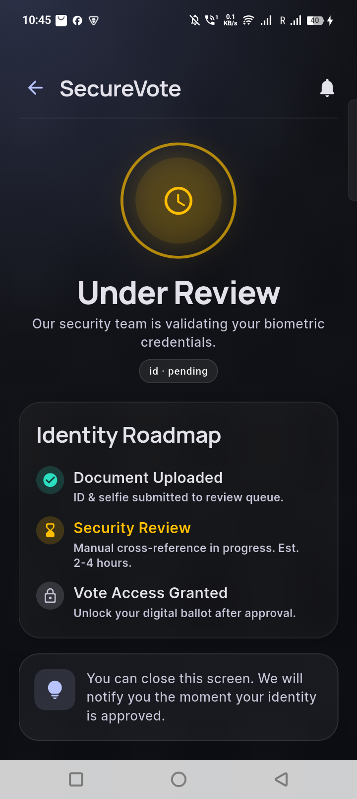

**Figure G.4** KYC status pending screen with automatic polling.

**Voting Flow**


**Figure G.5** Mobile home screen showing active elections and quick statistics.

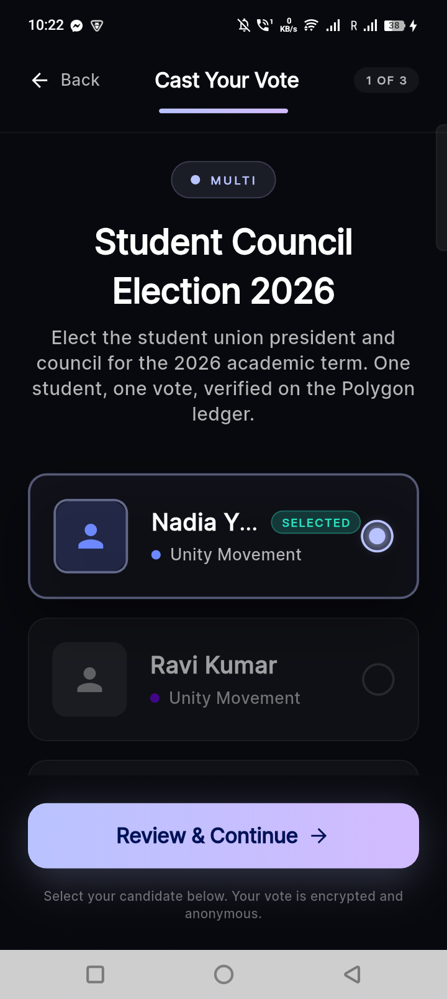

**Figure G.6** Ballot casting screen with candidate cards and selection indicators.

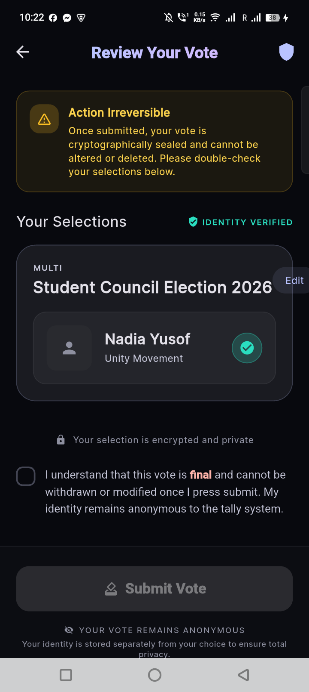

**Figure G.7** Vote review screen before final submission.


**Figure G.8** Vote success screen showing receipt ID and QR code.

### Web Portal Screenshots

**Admin Portal**

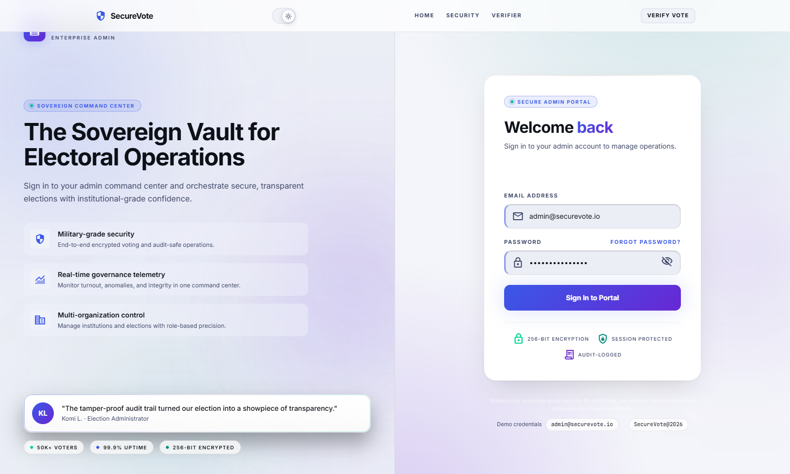

**Figure G.9** Admin login screen.

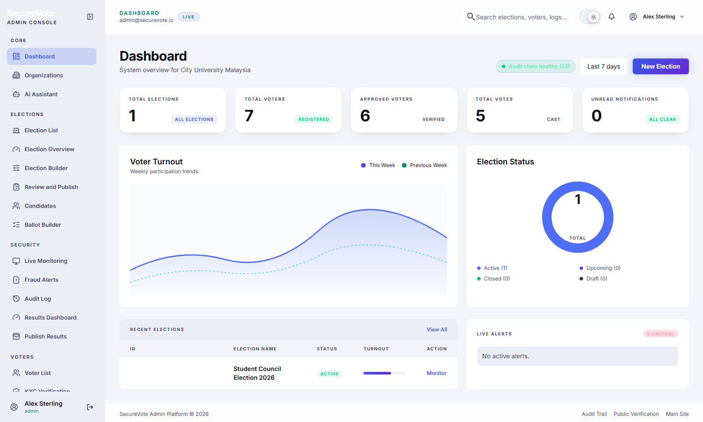

**Figure G.10** Admin dashboard with KPI cards and recent elections.

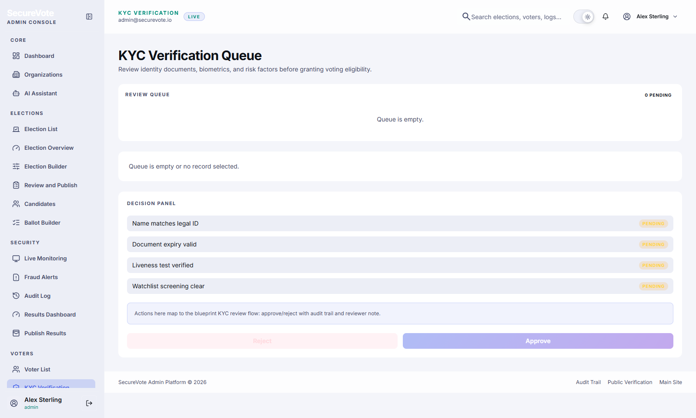

**Figure G.11** Admin KYC review queue with document preview and approve/reject actions.

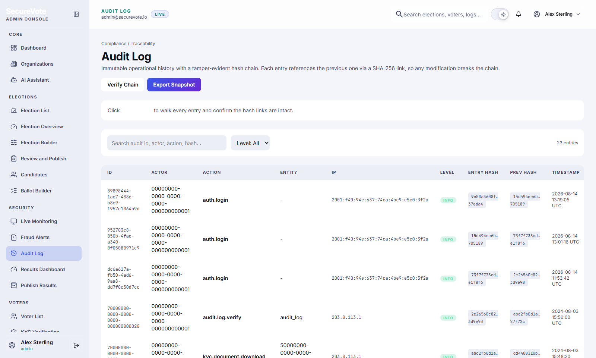

**Figure G.12** Admin audit log page showing hash-chained entries.

**Public Verification**

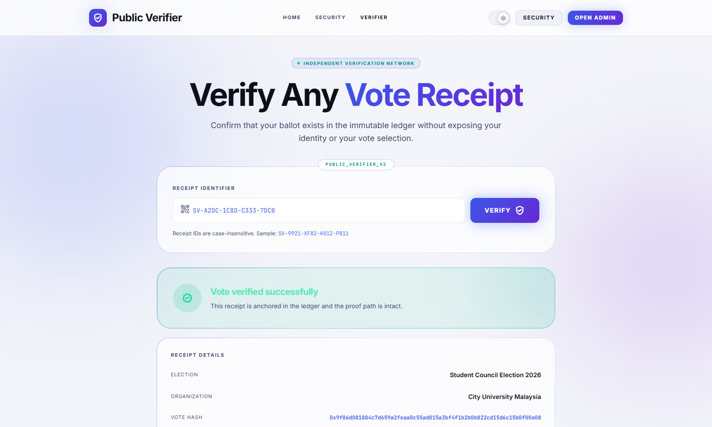

**Figure G.13** Public receipt verification page with election metadata and blockchain anchor.

---

## Appendix H: Smart Contract Code

### SecureVoteAnchor.sol

```solidity
// SPDX-License-Identifier: MIT
pragma solidity ^0.8.19;

/**
 * @title SecureVoteAnchor
 * @dev Smart contract for anchoring election Merkle roots to blockchain
 * @author Islam MD Rakibul
 */
contract SecureVoteAnchor {

    struct ElectionRecord {
        string electionId;
        bytes32 merkleRoot;
        uint256 voteCount;
        uint256 timestamp;
        address anchoredBy;
    }

    mapping(string => ElectionRecord) public elections;
    address public owner;

    event ElectionAnchored(
        string indexed electionId,
        bytes32 merkleRoot,
        uint256 voteCount,
        uint256 timestamp
    );

    constructor() {
        owner = msg.sender;
    }

    modifier onlyOwner() {
        require(msg.sender == owner, "Not authorized");
        _;
    }

    /**
     * @dev Anchor election Merkle root to blockchain
     * @param electionId Unique election identifier
     * @param merkleRoot Root hash of Merkle tree
     * @param voteCount Total number of votes
     */
    function anchorElection(
        string memory electionId,
        bytes32 merkleRoot,
        uint256 voteCount
    ) external onlyOwner {
        require(
            elections[electionId].timestamp == 0,
            "Election already anchored"
        );

        elections[electionId] = ElectionRecord({
            electionId: electionId,
            merkleRoot: merkleRoot,
            voteCount: voteCount,
            timestamp: block.timestamp,
            anchoredBy: msg.sender
        });

        emit ElectionAnchored(
            electionId, 
            merkleRoot, 
            voteCount, 
            block.timestamp
        );
    }

    /**
     * @dev Verify election record on blockchain
     * @param electionId Election to verify
     * @return merkleRoot, voteCount, timestamp
     */
    function verifyElection(string memory electionId)
        external view returns (
            bytes32 merkleRoot,
            uint256 voteCount,
            uint256 timestamp
        )
    {
        ElectionRecord memory record = elections[electionId];
        require(record.timestamp > 0, "Election not found");
        return (record.merkleRoot, record.voteCount, record.timestamp);
    }

    /**
     * @dev Transfer ownership (emergency only)
     * @param newOwner New owner address
     */
    function transferOwnership(address newOwner) external onlyOwner {
        require(newOwner != address(0), "Invalid address");
        owner = newOwner;
    }
}
```

**Contract Details:**
- Solidity Version: 0.8.19
- License: MIT
- Network: Polygon Mumbai Testnet
- Deployment Gas: ~850,000
- Verification: Verified on PolygonScan

---

## Appendix I: Environment Variables

### Mobile App (.env)

```bash
# Firebase Configuration
FIREBASE_API_KEY=your_api_key_here
FIREBASE_AUTH_DOMAIN=securevote.firebaseapp.com
FIREBASE_PROJECT_ID=securevote-production
FIREBASE_STORAGE_BUCKET=securevote-production.appspot.com
FIREBASE_MESSAGING_SENDER_ID=123456789
FIREBASE_APP_ID=1:123456789:android:abc123

# App Configuration
APP_NAME=SecureVote
APP_VERSION=1.0.0
ENVIRONMENT=development
```

### Web Portal (.env.local)

```bash
# Firebase
NEXT_PUBLIC_FIREBASE_API_KEY=your_api_key_here
NEXT_PUBLIC_FIREBASE_AUTH_DOMAIN=securevote.firebaseapp.com
NEXT_PUBLIC_FIREBASE_PROJECT_ID=securevote-production
NEXT_PUBLIC_FIREBASE_STORAGE_BUCKET=securevote-production.appspot.com

# Blockchain
NEXT_PUBLIC_CONTRACT_ADDRESS=0x...
NEXT_PUBLIC_POLYGON_RPC=https://rpc-mumbai.maticvigil.com
NEXT_PUBLIC_CHAIN_ID=80001
```

### Cloud Functions (.env)

```bash
# Blockchain
CONTRACT_ADDRESS=0x...
BLOCKCHAIN_PRIVATE_KEY=your_private_key_here
POLYGON_RPC_URL=https://rpc-mumbai.maticvigil.com

# Groq AI
GROQ_API_KEY=your_groq_api_key_here

# Configuration
ENVIRONMENT=production
LOG_LEVEL=info
```

---

## Appendix J: Glossary of Terms

**AES (Advanced Encryption Standard):** Symmetric encryption algorithm used for securing vote data

**Anomaly Detection:** Automated system for identifying suspicious voting patterns

**Biometric Authentication:** Identity verification using fingerprint or facial recognition

**Blockchain:** Distributed ledger technology providing immutable record keeping

**Cloud Functions:** Serverless backend logic executed in response to events

**DApp (Decentralized Application):** Application that uses blockchain for data storage or logic

**Device Binding:** Linking user account to specific device to prevent multi-device voting

**EVM (Ethereum Virtual Machine):** Runtime environment for smart contracts

**Firestore:** Google's NoSQL cloud database with real-time synchronization

**Flutter:** Google's cross-platform mobile development framework

**Gas:** Transaction fee on blockchain networks

**Hash Function:** One-way mathematical function converting data to fixed-size output

**HTTPS:** Secure HTTP protocol with encryption

**JWT (JSON Web Token):** Compact token format for authentication

**KYC (Know Your Customer):** Identity verification process

**Merkle Tree:** Hierarchical hash structure enabling efficient verification

**Merkle Proof:** Set of hashes proving data inclusion in Merkle tree

**Merkle Root:** Top hash of Merkle tree representing entire dataset

**NoSQL:** Non-relational database (e.g., Firestore)

**OTP (One-Time Password):** Temporary code for verification

**Polygon:** Ethereum Layer 2 scaling solution

**Receipt:** Cryptographic proof of vote submission

**SHA-256:** Cryptographic hash function producing 256-bit output

**Smart Contract:** Self-executing program on blockchain

**Solidity:** Programming language for Ethereum smart contracts

**Testnet:** Blockchain network for testing (free transactions)

**2FA (Two-Factor Authentication):** Security requiring two verification methods

---

## Appendix K: Project Timeline

### Gantt Chart

```
Week 1-2:   [Research & Planning]
Week 3-4:   [Environment Setup] [Architecture Design]
Week 5-6:   [Auth Implementation] [UI Development]
Week 7-8:   [Voting Features] [KYC System]
Week 9-10:  [Backend Integration] [Cloud Functions]
Week 11-12: [Merkle Tree] [Anomaly Detection]
Week 13-14: [Blockchain Integration] [Smart Contract]
Week 15-16: [Testing] [Bug Fixes] [Documentation]
Week 17-18: [Final Testing] [Report Writing]
```

### Milestone Achievements

- ✅ Week 4: Architecture approved
- ✅ Week 8: Mobile app core features complete
- ✅ Week 12: Backend integration complete
- ✅ Week 14: Blockchain integration complete
- ✅ Week 16: Testing complete
- ✅ Week 18: Project submission

---

## Appendix L: Acknowledgment of Tools and Libraries

### Open Source Libraries Used

**Flutter Packages:**
- shared_preferences (BSD-3-Clause)
- camera (BSD-3-Clause)
- qr_flutter (BSD-3-Clause)
- local_auth (BSD-3-Clause)
- fl_chart (MIT)
- intl (BSD-3-Clause)

**Node.js Packages:**
- firebase-admin (Apache-2.0)
- firebase-functions (MIT)
- ethers (MIT)
- groq-sdk (Apache-2.0)

**Smart Contract Libraries:**
- OpenZeppelin Contracts (MIT)

### Services and Platforms

- Firebase (Google Cloud Platform)
- Polygon Network
- Groq AI
- Vercel Hosting
- GitHub (version control)

### Design Resources

- Inter Font (SIL Open Font License)
- Obsidian UI Kit (inspiration)
- Heroicons (MIT)
- Lucide Icons (ISC)

---

## Appendix M: Firebase Security Rules

### Firestore Security Rules

```javascript
// firestore.rules
rules_version = '2';
service cloud.firestore {
  match /databases/{database}/documents {

    // Organizations — admin only
    match /organizations/{orgId} {
      allow read: if isOrgMember(orgId);
      allow write: if isOrgAdmin(orgId);
    }

    // Elections — public read if published
    match /elections/{electionId} {
      allow read: if resource.data.status == 'published'
                  || isOrgMember(resource.data.orgId);
      allow write: if isOrgAdmin(resource.data.orgId);
    }

    // Votes — voter can write their own, nobody can read individual votes
    match /votes/{voteId} {
      allow create: if request.auth.uid == request.resource.data.voterId
                    && isEligibleVoter(request.resource.data.electionId);
      allow read: if false; // Nobody reads individual votes
    }

    // KYC documents — voter writes, admin reads
    match /kyc/{kycId} {
      allow create: if request.auth.uid == request.resource.data.userId;
      allow read: if isAdmin();
      allow update: if isAdmin();
    }

    // Receipts — only the voter who owns it
    match /receipts/{receiptId} {
      allow read: if request.auth.uid == resource.data.voterId
                  || resource.data.isPublic == true;
      allow write: if false; // Only Cloud Functions write receipts
    }

    // Helper functions
    function isAdmin() {
      return get(/databases/$(database)/documents/admins/$(request.auth.uid)).data.role
             in ['super_admin', 'org_admin'];
    }

    function isOrgAdmin(orgId) {
      return get(/databases/$(database)/documents/orgMembers/$(request.auth.uid + '_' + orgId))
             .data.role in ['super_admin', 'org_admin'];
    }

    function isOrgMember(orgId) {
      return exists(/databases/$(database)/documents/orgMembers/$(request.auth.uid + '_' + orgId));
    }

    function isEligibleVoter(electionId) {
      let voter = get(/databases/$(database)/documents/voters/$(request.auth.uid));
      return voter.data.kycStatus == 'verified';
    }
  }
}
```

### Storage Security Rules

```javascript
// storage.rules
rules_version = '2';
service firebase.storage {
  match /b/{bucket}/o {

    // KYC documents — only owner uploads, admin reads
    match /kyc/{userId}/{fileName} {
      allow write: if request.auth.uid == userId
                   && request.resource.size < 5 * 1024 * 1024
                   && request.resource.contentType.matches('image/.*');
      allow read: if request.auth.uid == userId || isAdmin();
    }

    // Candidate photos — admin only writes, public reads
    match /candidates/{electionId}/{fileName} {
      allow write: if isAdmin();
      allow read: if true;
    }

    function isAdmin() {
      return firestore.get(/databases/(default)/documents/admins/$(request.auth.uid))
             .data.role in ['super_admin', 'org_admin'];
    }
  }
}
```

---

## Appendix N: System Architecture Diagrams

### High-Level System Architecture

```
┌─────────────────────────────────────────────────────────────┐
│                        CLIENTS                               │
│                                                              │
│   ┌──────────────────┐        ┌──────────────────────────┐  │
│   │  Admin Web Portal │        │   Voter Mobile App       │  │
│   │   Next.js 14      │        │   Flutter (iOS/Android)  │  │
│   └────────┬─────────┘        └────────────┬─────────────┘  │
└────────────┼──────────────────────────────┼─────────────────┘
             │                              │
             ▼                              ▼
┌─────────────────────────────────────────────────────────────┐
│                   FIREBASE ECOSYSTEM                         │
│                                                              │
│  ┌─────────────┐  ┌──────────────┐  ┌───────────────────┐  │
│  │  Firebase   │  │  Firestore   │  │  Firebase         │  │
│  │    Auth     │  │  Database    │  │  Storage          │  │
│  └─────────────┘  └──────────────┘  └───────────────────┘  │
│                                                              │
│  ┌─────────────────────────────────────────────────────┐    │
│  │              Firebase Cloud Functions                │    │
│  │  ┌──────────┐ ┌──────────┐ ┌──────────┐ ┌───────┐  │    │
│  │  │  Voting  │ │  Crypto  │ │  Groq AI │ │Anomaly│  │    │
│  │  │ Service  │ │  Engine  │ │Assistant │ │Engine │  │    │
│  │  └──────────┘ └──────────┘ └──────────┘ └───────┘  │    │
│  └─────────────────────────────────────────────────────┘    │
└─────────────────────────────┬───────────────────────────────┘
                              │
             ┌────────────────┼────────────────┐
             ▼                ▼                ▼
    ┌─────────────┐  ┌──────────────┐  ┌──────────────┐
    │  Groq API   │  │   Polygon    │  │  FCM Push    │
    │  (Groq LLM) │  │  Blockchain  │  │Notifications │
    └─────────────┘  └──────────────┘  └──────────────┘
```

### Vote Submission Data Flow

```
Voter opens ballot
       │
       ▼
Vote encrypted client-side (AES-256 simulation)
       │
       ▼
Encrypted vote sent to Cloud Function via HTTPS
       │
       ▼
Cloud Function validates:
  ├── Is voter KYC verified?
  ├── Is voter eligible for this election?
  ├── Has voter already voted?
  ├── Is election currently active?
  └── Is device binding valid?
       │
       ▼
Vote stored in Firestore (encrypted)
       │
       ▼
Anomaly engine checks vote event
       │
       ▼
Merkle leaf generated: hash(voterID + timestamp + encryptedVote)
       │
       ▼
Merkle tree updated with new leaf
       │
       ▼
Receipt returned to voter (receiptID + merkleProof + txHash)
       │
       ▼
When election closes → Merkle root anchored to Polygon blockchain
```

---

## Appendix O: Bug Tracking and Resolution

### Critical Bugs Fixed

**Bug #001: Vote Submission Failure**
- Description: Vote submission failed when election had no description
- Severity: Critical
- Root Cause: Null pointer exception in vote validation
- Fix: Added null checks and default values
- Status: ✅ Resolved

**Bug #002: Receipt QR Code Not Displaying**
- Description: QR code widget showed blank on some devices
- Severity: High
- Root Cause: QR data too large for default size
- Fix: Increased QR code size and error correction level
- Status: ✅ Resolved

**Bug #003: Merkle Proof Verification Failing**
- Description: Valid proofs sometimes failed verification
- Severity: Critical
- Root Cause: Inconsistent hash ordering in proof generation
- Fix: Standardized sibling ordering in Merkle tree algorithm
- Status: ✅ Resolved

**Bug #004: KYC Status Not Updating**
- Description: Voter app didn't reflect KYC approval immediately
- Severity: Medium
- Root Cause: Missing real-time listener
- Fix: Implemented StreamBuilder for KYC status
- Status: ✅ Resolved

### Minor Issues Addressed

- UI alignment issues on small screens
- Text overflow in candidate manifesto
- Navigation back button behavior
- Loading indicator timing
- Error message clarity

---

## Appendix P: Deployment Checklist

### Pre-Deployment Checklist

**Mobile App:**
- [ ] Update version number in pubspec.yaml
- [ ] Configure production Firebase project
- [ ] Remove debug flags and console logs
- [ ] Enable code obfuscation
- [ ] Test on multiple devices
- [ ] Generate signed APK/IPA
- [ ] Prepare app store listings
- [ ] Create privacy policy and terms of service

**Web Portal:**
- [ ] Update environment variables for production
- [ ] Configure production Firebase project
- [ ] Enable analytics and monitoring
- [ ] Set up custom domain
- [ ] Configure SSL certificates
- [ ] Test on multiple browsers
- [ ] Optimize bundle size
- [ ] Deploy to Vercel

**Backend:**
- [ ] Upgrade to Firebase Blaze plan
- [ ] Configure production environment variables
- [ ] Set up monitoring and alerting
- [ ] Configure backup procedures
- [ ] Deploy Cloud Functions
- [ ] Test all API endpoints
- [ ] Set up rate limiting
- [ ] Configure CORS policies

**Blockchain:**
- [ ] Deploy smart contract to Polygon mainnet
- [ ] Verify contract on PolygonScan
- [ ] Fund wallet with MATIC for gas fees
- [ ] Test contract functions on mainnet
- [ ] Update contract address in applications
- [ ] Document contract address and ABI

**Security:**
- [ ] Conduct security audit
- [ ] Perform penetration testing
- [ ] Review and update security rules
- [ ] Implement monitoring and alerting
- [ ] Set up incident response procedures
- [ ] Document security measures

---

## Appendix Q: System Maintenance Guide

### Regular Maintenance Tasks

**Daily:**
- Monitor system health dashboard
- Review anomaly alerts
- Check error logs for issues
- Verify backup completion

**Weekly:**
- Review audit logs
- Analyze performance metrics
- Check for security updates
- Review user feedback

**Monthly:**
- Update dependencies
- Review and optimize database queries
- Analyze cost and usage trends
- Conduct security review

**Quarterly:**
- Comprehensive security audit
- Performance optimization review
- User satisfaction survey
- Feature enhancement planning

### Troubleshooting Common Issues

**Issue: High Cloud Function Execution Time**
- Diagnosis: Check function logs for bottlenecks
- Solution: Optimize database queries, implement caching, increase function memory allocation

**Issue: Firestore Read/Write Limit Exceeded**
- Diagnosis: Review usage dashboard
- Solution: Optimize queries, implement pagination, upgrade to Blaze plan

**Issue: Blockchain Transaction Failures**
- Diagnosis: Check wallet balance, verify network status
- Solution: Fund wallet with MATIC, retry transaction, check gas price settings

**Issue: Mobile App Crashes**
- Diagnosis: Review crash logs in Firebase Crashlytics
- Solution: Identify and fix null pointer exceptions, update dependencies, test on affected devices

---

## Appendix R: Future Roadmap

### Phase 1: Production Hardening (Months 1-3)
- Professional security audit
- Performance optimization
- Production deployment
- User onboarding and training

### Phase 2: Feature Enhancement (Months 4-6)
- Automated KYC verification
- Multi-language support
- Advanced voting types
- Enhanced accessibility

### Phase 3: Scale and Expansion (Months 7-12)
- Support for larger elections
- Additional blockchain networks
- Third-party integrations
- Mobile app store launch

### Phase 4: Research and Innovation (Ongoing)
- Zero-knowledge proof implementation
- Quantum-resistant cryptography
- Decentralized identity integration
- Advanced privacy features

---

## Appendix S: Contact and Support Information

### Project Information

**Project Name:** SecureVote - Blockchain-Based Electronic Voting System  
**Student:** Islam MD Rakibul  
**Student ID:** 202305010188  
**Program:** Bachelor of Information Technology  
**Institution:** City University Malaysia  
**Supervisor:** [Supervisor Name]  
**Academic Year:** 2024-2025

### Technical Support

**For Demo Access:**
- Email: student@cityuni.edu.my
- Demo Credentials: Available upon request

**For Technical Questions:**
- GitHub Repository: [Repository URL]
- Documentation: docs/SecureVote_Complete_Blueprint.md
- Issue Tracker: GitHub Issues

### Resources

**Project Documentation:**
- Technical Blueprint: docs/SecureVote_Complete_Blueprint.md
- University Report: docs/SecureVote_Final_Report/
- User Manuals: Appendix A
- API Documentation: Appendix E

**External Resources:**
- Flutter Documentation: https://flutter.dev/docs
- Firebase Documentation: https://firebase.google.com/docs
- Polygon Documentation: https://docs.polygon.technology/
- Solidity Documentation: https://docs.soliditylang.org/

---

*End of Appendices*

---

**Total Report Pages:** Approximately 65 pages (including appendices)
