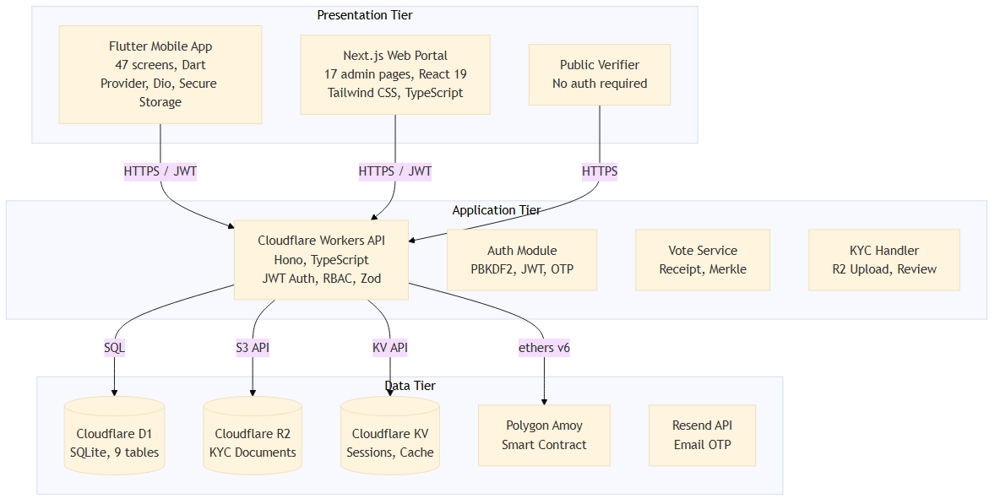
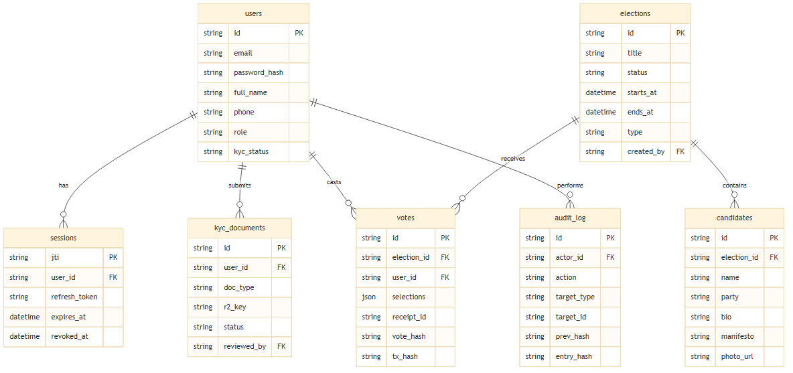

# Chapter 4: System Design

## 4.1 Introduction

System design is a critical stage in the software development life cycle that transforms the requirements identified during analysis into a well-structured, implementable model. It defines the system architecture, components, interfaces, data flows, and interactions between subsystems to ensure the final implementation meets the project's functional and non-functional requirements (Pressman & Maxim, 2020). A well-planned design reduces redundancy, improves scalability, and ensures maintainability throughout the system's lifecycle.

For SecureVote, the system design phase provides a technical foundation that supports secure electronic voting through mobile and web interfaces. The design must address several competing requirements: the system must be accessible to ordinary voters with minimal technical skill, secure enough to prevent tampering and fraud, transparent enough to allow public verification, and scalable enough to handle elections with thousands of participants. These requirements are met through a modular, three-tier architecture that separates the presentation layer from the business logic and data layers.

This chapter describes the complete system design of SecureVote, including the architectural framework, component overview, data models, process designs, and interface designs that guide implementation. The design decisions are presented with justification so that the relationship between requirements and implementation is clear.

## 4.2 Overview of System Design

The SecureVote system is designed to enable secure, transparent, and accessible electronic voting through a blockchain-based platform. The system replaces traditional paper-based or centralized electronic voting with a distributed architecture that combines mobile technology, cloud infrastructure, and blockchain verification.

The system is divided into three primary subsystems, each with a clear responsibility and well-defined interface to the others:

1. **Flutter Mobile Application** — the voter-facing interface covering registration, OTP verification, KYC submission, election browsing, vote casting, receipt viewing, and vote verification. The app has 47 screens across 6 feature areas: authentication, KYC, elections, voting, receipts, and profile.

2. **Next.js Web Portal** — the administrative interface with 29 routes and 17 admin pages covering dashboard statistics, election management, voter registry, KYC review, audit log, anomaly alerts, and public receipt verification. The portal is also used by verifiers who need read-only access to election results.

3. **Cloudflare Workers API** — the backend layer handling authentication, election management, voting, KYC processing, audit logging, and blockchain integration. The API exposes endpoints under `/api/*` with JWT-based authentication and role-based access control.

Each subsystem communicates through well-defined REST API contracts. The mobile app and web portal send HTTPS requests with Bearer JWT tokens to the backend API. The backend stores data in Cloudflare D1, files in R2, sessions in KV, and anchors election results to the Polygon blockchain. This separation of concerns allows each subsystem to be developed, tested, and deployed independently while still working together as a unified platform.

### 4.2.1 System Components Overview

**Table 1.** Major system components, technologies used, and core functions.

| No | Component | Technology | Description |
|---|---|---|---|
| 1 | Voter Mobile App | Flutter 3.x, Dart, Provider, Dio, flutter_secure_storage | 47 screens for voter registration, KYC, election browsing, vote casting, receipt viewing, and profile management. JWT tokens stored in device Keychain/Keystore. The app is the primary voting interface for ordinary users. |
| 2 | Admin Web Portal | Next.js 16, React 19, Tailwind CSS 4, TypeScript | 17 admin pages for dashboard, election management, voter registry, KYC review, audit log, anomaly alerts, and public receipt verifier. Provides the administrative control centre for election organisers. |
| 3 | Verifier Web Portal | Next.js 16, React 19, Tailwind CSS 4 | Read-only public verifier page that allows anyone to confirm a vote receipt without authentication. This supports independent election observers and transparency requirements. |
| 4 | Backend API | Cloudflare Workers, Hono, Zod, TypeScript | REST API handling authentication, elections, voting, KYC, admin operations, and public verification. JWT-based auth with RBAC. Stateless edge functions run close to users for low latency. |
| 5 | Database | Cloudflare D1 (SQLite at edge) | 9 tables with foreign keys and indexes. Stores users, elections, candidates, votes, KYC documents, audit logs, and notifications. Supports ACID transactions and prepared statements. |
| 6 | File Storage | Cloudflare R2 (S3-compatible) | Stores KYC document images securely. Accessed via signed URLs generated by the backend so private documents are never exposed publicly. |
| 7 | Session Store | Cloudflare KV | Stores active sessions, rate limit counters, and short-lived API caches. KV provides low-latency global access to session state. |
| 8 | Blockchain | Polygon Amoy testnet, Solidity 0.8.24 | Smart contract for anchoring election Merkle roots. Public verification through block explorer. Provides tamper-evident final election records. |
| 9 | Email Service | Resend API | Sends OTP verification emails during registration. Rate-limited to 3 sends per email per hour to prevent abuse. |

### 4.2.2 System Workflow

The system workflow demonstrates the interaction between all components, ensuring a seamless process from voter registration to vote verification. The workflow is designed to be intuitive for voters while enforcing strict security and verification at every stage.

**Voter Registration.** A voter downloads the Flutter app and creates an account with email and password. The system validates the input format, hashes the password using PBKDF2-SHA256, and sends a six-digit OTP to the registered email address. After the voter verifies the OTP, the system creates an account in D1 with role `voter` and `kyc_status = unverified`. The voter is then directed to the KYC flow.

**KYC Verification.** The voter uploads an identity document and a selfie photo through the app. The app sends the files via a multipart POST request to the backend. The backend stores the files in Cloudflare R2 under a private path and creates a `kyc_documents` record in D1 with status `pending`. An administrator reviews the submission through the web portal, approves or rejects it with a note, and the system updates the voter's KYC status. The voter receives an in-app and email notification of the decision.

**Election Browsing.** Once KYC is approved, the voter can browse active elections. The API returns election details, candidate information, and ballot structure from D1. The voter can view candidate profiles, read manifestos, and compare candidates before casting a vote.

**Vote Casting.** The voter selects candidates on the ballot screen, reviews the selections on a confirmation screen, and submits. The system checks the voter's KYC status (must be `approved`) and checks for an existing vote using the `UNIQUE(election_id, user_id)` constraint. It then generates a SHA-256 vote hash from the election ID, user ID, selections, receipt ID, timestamp, and nonce. The vote is stored in D1 and the receipt is returned to the voter.

**Receipt and Verification.** The voter views the receipt containing a unique receipt ID (format `SV-XXXX-XXXX-XXXX-XXXX`) and a QR code. The receipt can be verified publicly through the `/verifier` page on the web portal. The public verifier calls the API endpoint and returns the election title, vote hash, and blockchain anchor details without revealing the voter identity or selections.

**Blockchain Anchoring.** When an election closes, the system computes a Merkle root from all vote hashes in that election and submits it to the Polygon blockchain smart contract via the `finalize` function. The transaction hash and block number are stored with the election record. This allows independent verification that the final result set has not been altered.

**Admin Monitoring.** Throughout the election lifecycle, administrators monitor turnout through the dashboard, review KYC submissions, manage election status transitions, investigate anomaly alerts, and audit system actions. Every privileged action is recorded in the audit log with a hash chain for tamper detection.

### 4.2.3 System Architecture Diagram

**Figure 1.** SecureVote system architecture showing the three-tier design: Flutter mobile app, Next.js web portal, and public verifier at the presentation tier; Cloudflare Workers API and internal modules at the application tier; Cloudflare D1, R2, KV, Polygon blockchain, and Resend at the data tier.

## 4.3 Types of Design

### 4.3.1 Architectural Design

SecureVote follows a three-tier architecture that separates concerns between presentation, application, and data layers. This separation is a well-established design pattern that improves maintainability, testability, and scalability.

**Presentation Tier.** The Flutter mobile application provides the voter interface with 47 screens. State management is handled through the Provider package, with an `AuthProvider` as a `ChangeNotifier` provided app-wide in `main.dart`. HTTP communication uses Dio 5.x with a custom interceptor that attaches JWT tokens and transparently refreshes access tokens on 401 responses. Secure storage uses `flutter_secure_storage` to store tokens in the iOS Keychain or Android Keystore. The Next.js web portal provides the admin and verifier interfaces with React context for authentication and typed API hooks for data fetching. All pages are prerendered as static HTML for fast initial loads.

**Application Tier.** The Cloudflare Workers backend processes all business logic using the Hono framework. Request validation is enforced through Zod schemas on every endpoint. Authentication uses HS256 JWT tokens with 24-hour access tokens and 30-day refresh tokens stored in the `sessions` table. Role-based access control distinguishes between `voter`, `admin`, and `verifier` roles through middleware. Rate limiting is enforced through KV-backed counters on authentication endpoints to prevent brute force attacks. The backend is divided into route modules for auth, elections, voting, KYC, admin, and public endpoints, each handling a specific domain.

**Data Tier.** Cloudflare D1 stores all relational data in 9 tables with foreign key constraints and indexes. Cloudflare R2 stores KYC document images accessed via signed URLs. Cloudflare KV manages session state and rate limit counters. The Polygon blockchain stores anchored election Merkle roots for tamper-evident verification. Resend handles email delivery for OTP codes.

The three-tier architecture was chosen because it allows each layer to be scaled and maintained independently. For example, the presentation layer can be updated with new UI designs without changing the backend API contract, and the database schema can be migrated without affecting the frontend.

### 4.3.2 Interface Design

**Mobile App Interface.** The Flutter app uses a dark-themed design system intended to convey modernity and trust. The colour palette uses Lavender Blue (#B9C3FF) as the primary colour, Light Purple (#D2BBFF) as secondary, and Turquoise (#2ADEC0) as the accent for success states. The Inter font family is used throughout with varying weights: 900 for headings, 500–600 for body text, and 700 for labels and buttons. Navigation follows a bottom bar pattern with 5 main sections, supplemented by stack navigation for deep flows and modal presentation for temporary contexts. Form inputs include validation states, and feedback is provided through snackbars and modal confirmations.

Key screens include the home screen with active elections and statistics, the ballot screen with candidate cards and selection indicators, the receipt screen with the QR code and verification link, and the KYC screen with camera capture and status tracking. The design prioritises clarity and simplicity so that voters with basic smartphone proficiency can complete the voting process in fewer than five steps.

**Web Portal Interface.** The Next.js portal uses Tailwind CSS for styling with a responsive layout. The admin shell features a persistent sidebar navigation, a top bar with user profile and notification bell, and a main content area. Data-driven pages display loading, error, and empty states uniformly so that administrators always understand what the system is showing. The public verifier page is intentionally minimal and accessible without authentication, requiring only a receipt ID to display verification results.

### 4.3.3 Data Design

The SecureVote database contains 9 tables in Cloudflare D1, defined through SQL migrations. The schema is designed to enforce data integrity at the database level rather than relying solely on application logic.

**Table 2.** Database tables and their purposes.

| Table | Purpose | Key Fields | Constraints |
|---|---|---|---|
| users | Voter and admin profiles | id, email, password_hash, full_name, phone, role, kyc_status | Primary key on id, unique email |
| pending_verifications | OTP verification records | email, otp_hash, attempts, expires_at | Index on email and expires_at |
| sessions | Active user sessions | jti, user_id, refresh_token, expires_at, revoked_at | Primary key on jti, foreign key to users |
| elections | Election definitions | id, title, status, starts_at, ends_at, type, created_by | Primary key on id, foreign key to users |
| candidates | Candidate profiles | id, election_id, name, party, bio, manifesto, photo_url, ballot_order | Primary key on id, foreign key to elections |
| ballot_blocks | Ballot structure | id, election_id, title, kind, order_index | Primary key on id, foreign key to elections |
| votes | Cast votes | id, election_id, user_id, selections, receipt_id, vote_hash, tx_hash, block_number, merkle_proof | UNIQUE(election_id, user_id), foreign keys to elections and users |
| kyc_documents | KYC submissions | id, user_id, doc_type, r2_key, status, admin_note, reviewed_by | Primary key on id, foreign keys to users |
| audit_log | System audit trail | id, actor_id, action, target_type, target_id, metadata, ip, prev_hash, entry_hash | Primary key on id, foreign key to users |

**Anti-double-vote enforcement.** The `votes` table enforces a `UNIQUE(election_id, user_id)` constraint at the database level, making it impossible for a user to cast two votes in the same election regardless of application logic. The application layer also pre-checks via `GET /api/voting/voted/:electionId` before presenting the ballot, providing a fast user-facing guard in addition to the database constraint.

**Ballot secrecy.** The public verifier endpoint returns receipt metadata (election title, vote hash, block number) but never exposes which user voted or what they selected. This preserves ballot secrecy while still allowing public verification that the vote was recorded.

**Audit log hash chain.** Each `audit_log` row stores `prev_hash` (the `entry_hash` of the previous row) and `entry_hash` (SHA-256 of the row's serialized content). The verification endpoint walks the chain and detects tampering, returning the first entry where the chain breaks.

**Index design.** Foreign key columns are indexed to support join queries. The `votes` table has a composite index on `(election_id, user_id)` to support both the uniqueness constraint and fast lookup. The `kyc_documents` table is indexed on `user_id` and `status` to support the admin review queue.

### 4.3.4 Component-Level Design

**Table 3.** Component-level design summary.

| Component | Module | Key Responsibilities | Interactions |
|---|---|---|---|
| AuthProvider | Flutter core | Manages login state, session restoration, auto-logout on token expiry | Reads/writes secure storage, calls auth API |
| Dio Interceptor | Flutter core | Attaches JWT, auto-refreshes on 401, handles error parsing | Intercepts all API calls |
| API Client | Web portal | Typed fetch wrapper with auth header injection and error handling | Called by all admin/verifier pages |
| Auth Middleware | Backend | JWT validation, session check, RBAC enforcement | Runs before protected route handlers |
| Vote Service | Backend | Validates vote, checks KYC status, generates receipt, stores vote | Calls Merkle engine and database |
| Merkle Engine | Backend | Computes Merkle root from vote hashes, generates proofs | Called by vote service and blockchain adapter |
| Blockchain Adapter | Backend | ethers v6 wrapper for Polygon contract calls | Called when anchoring or verifying on-chain |
| KYC Handler | Backend | File upload to R2, document review workflow, status notifications | Stores files, writes to database, sends notifications |
| Audit Logger | Backend | Writes privileged actions to audit_log with hash chain | Called by all privileged operations |
| Rate Limiter | Backend | KV-backed rate limiting on auth endpoints | Runs before auth route handlers |

## 4.4 Process and Data Model Design

### 4.4.1 Process Design

The core processes in SecureVote are the voting workflow, KYC verification workflow, and admin monitoring workflow. Each process is described below with its steps and data interactions.

**Voting Process:**
1. Voter opens the app and authenticates with email and password.
2. The system validates credentials against the `users` table, checks the password hash, and generates JWT access and refresh tokens.
3. Voter browses active elections from the `elections` and `candidates` tables via the API.
4. Voter selects an election and views candidate details including photos, bios, and manifestos.
5. Voter selects candidates on the ballot screen, with the interface matching the election type (single-choice, multi-choice, or ranked).
6. Voter reviews selections on a confirmation screen and confirms submission.
7. The system checks KYC status (must be `approved`) in the `users` table.
8. The system checks for an existing vote using the `votes` table and the application-level pre-check.
9. The system generates a SHA-256 vote hash and a unique receipt ID.
10. The system stores the vote in the `votes` table within a transaction and returns the receipt to the voter.
11. The system sends a confirmation notification through the `notifications` table.

**KYC Verification Process:**
1. Voter navigates to the KYC section in the app after registration.
2. Voter captures an ID document photo using the device camera.
3. Voter captures a selfie photo for identity matching.
4. The app uploads the files to the backend via multipart POST to `/api/kyc/submit`.
5. The backend stores files in Cloudflare R2 under a private path keyed by user ID.
6. The backend creates a `kyc_documents` record with status `pending`.
7. An admin opens the KYC review queue in the web portal, which queries pending documents.
8. The admin views the document preview, reviews the submission, and clicks approve or reject.
9. The backend updates `kyc_documents.status` and `users.kyc_status` in the same transaction.
10. The system sends an in-app notification and email to the voter.
11. If approved, the voter can now browse and vote in active elections.

**Admin Monitoring and Audit Process:**
1. Admin logs into the web portal with valid credentials.
2. Admin performs a privileged action such as creating an election, reviewing KYC, or transitioning election status.
3. The backend validates the admin's role and permissions through the JWT and RBAC middleware.
4. The backend executes the action within a database transaction.
5. The audit logger writes a record to `audit_log` including the actor, action, target, metadata, IP, previous hash, and current entry hash.
6. The admin dashboard reflects the updated state in near real time.
7. Any anomaly detected by the system (e.g., unusual voting patterns) creates an alert in the admin dashboard for investigation.

### 4.4.2 Data Model Design

The key entities and their relationships in the SecureVote data model are shown in the ER diagram. The relationships are enforced through foreign key constraints in the D1 database.

**Table 4.** Key entities and relationships.

| Entity | Key Attributes | Relationships | Cardinality |
|---|---|---|---|
| users | id, email, role, kyc_status | has many sessions, votes, kyc_documents, audit_log entries | One-to-many |
| sessions | jti, user_id, refresh_token | belongs to one user | Many-to-one |
| elections | id, title, status, starts_at, ends_at | has many candidates, ballot_blocks, votes | One-to-many |
| candidates | id, election_id, name, party | belongs to one election | Many-to-one |
| ballot_blocks | id, election_id, title, kind | belongs to one election | Many-to-one |
| votes | id, election_id, user_id, vote_hash, receipt_id | belongs to one election and one user | Many-to-one (twice) |
| kyc_documents | id, user_id, doc_type, status | belongs to one user and one reviewer | Many-to-one (twice) |
| audit_log | id, actor_id, action, entry_hash | belongs to one actor | Many-to-one |
| notifications | id, user_id, title, body | belongs to one user | Many-to-one |

## 4.5 Entity Relationship Diagram

**Figure 2.** SecureVote entity relationship diagram showing core entities and their relationships across the user, election, voting, KYC, and audit domains.

The core relationships in the database schema are:

- **Users to Sessions** — one-to-many. A user can have multiple active sessions across different devices or browsers. Each session is identified by a JWT ID (`jti`) and can be revoked independently.

- **Users to KYC Documents** — one-to-many. A user can submit multiple KYC documents over time (for example, if the first submission is rejected and a new one is submitted). Each document is reviewed by an admin user, creating a second relationship from users to kyc_documents through `reviewed_by`.

- **Elections to Candidates** — one-to-many. An election contains multiple candidates. Candidates are ordered by `ballot_order` for display on the ballot.

- **Elections to Ballot Blocks** — one-to-many. An election may have multiple ballot blocks (positions or questions) that group candidates together.

- **Elections to Votes** — one-to-many. An election receives many votes. The `votes` table also links back to users, so a user can vote in multiple elections but only once per election.

- **Users to Votes** — one-to-many. A user can cast votes in multiple elections. The combination of `election_id` and `user_id` is unique, enforcing the one-vote-per-election rule.

- **Users to Audit Log** — one-to-many. A user's privileged actions generate many audit entries. The `actor_id` foreign key links each audit entry to the user who performed the action.

## 4.6 Conclusion

This chapter presented the detailed system design of the SecureVote platform, covering architectural, interface, data, and component-level design. The three-tier architecture separates concerns between the Flutter mobile app and Next.js web portal at the presentation tier, the Cloudflare Workers API at the application tier, and D1, R2, KV, and Polygon blockchain at the data tier. The system components and their interactions were described, including the voter mobile app, admin web portal, verifier interface, backend API, database, file storage, and blockchain anchoring service.

The database design uses 9 tables with foreign key constraints, a UNIQUE constraint for anti-double-vote enforcement, and a hash-chained audit log for tamper detection. The process design covered the voting workflow, KYC verification workflow, and admin monitoring workflow. The component-level design explained how each module contributes to the system and how modules interact. The next chapter describes the implementation and testing of this design.

## References

Bass, L., Clements, P., & Kazman, R. (2021). *Software architecture in practice* (4th ed.). Addison-Wesley Professional.

Pressman, R. S., & Maxim, B. R. (2020). *Software engineering: A practitioner's approach* (9th ed.). McGraw-Hill Education.

Richards, M., & Ford, N. (2020). *Fundamentals of software architecture: A engineering approach*. O'Reilly Media.
