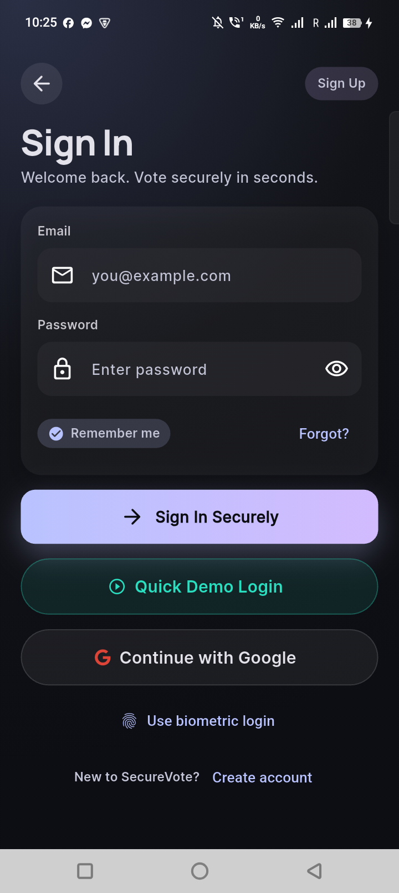
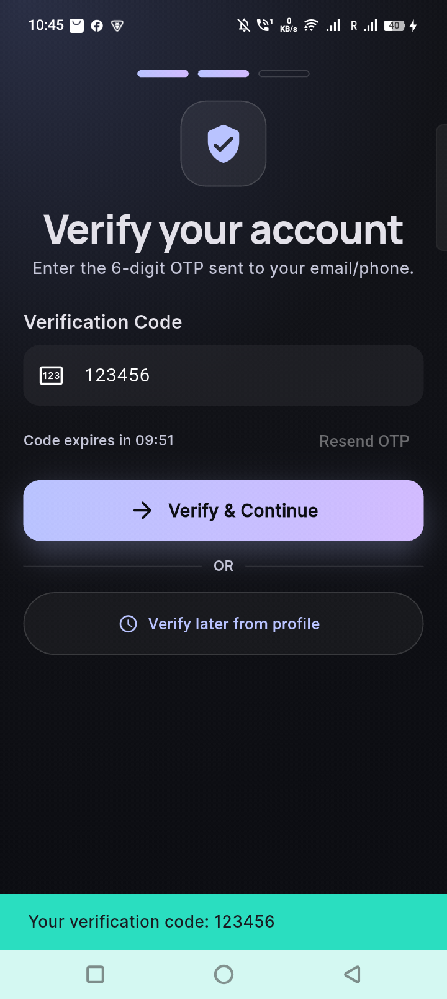
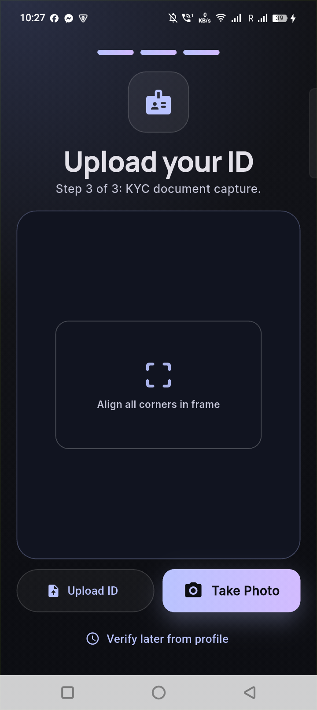
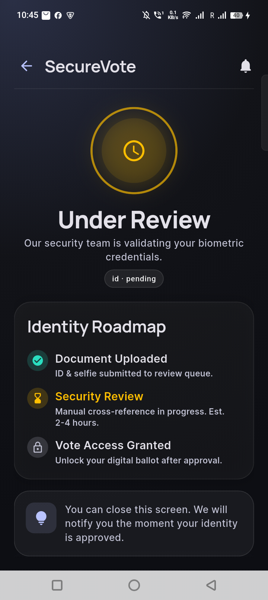
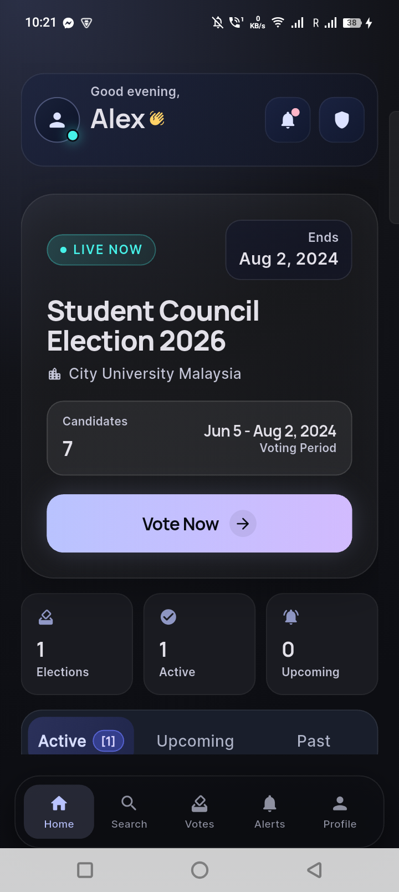
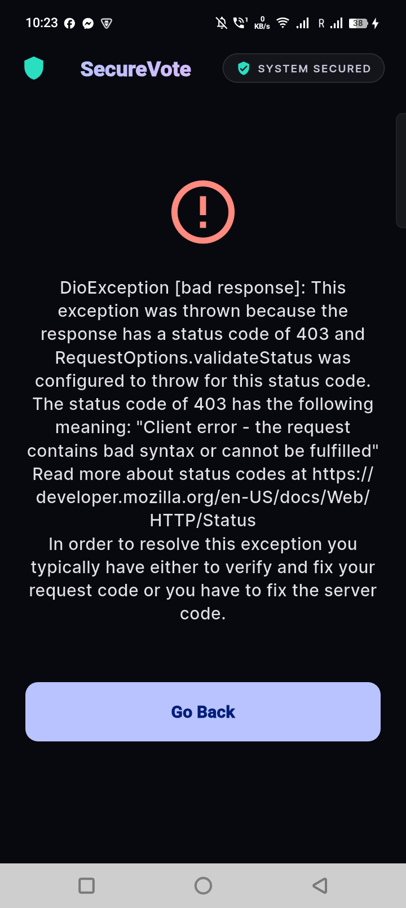
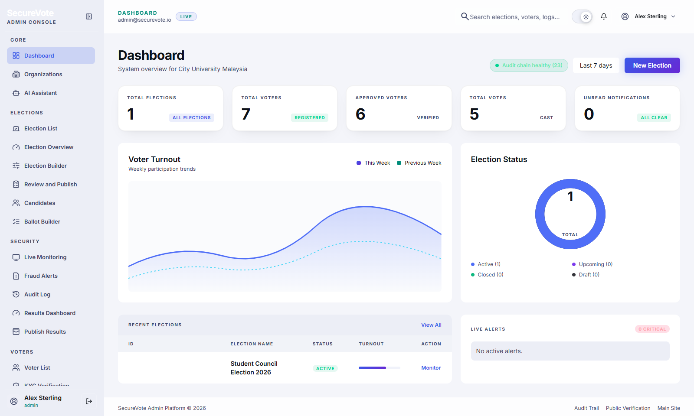
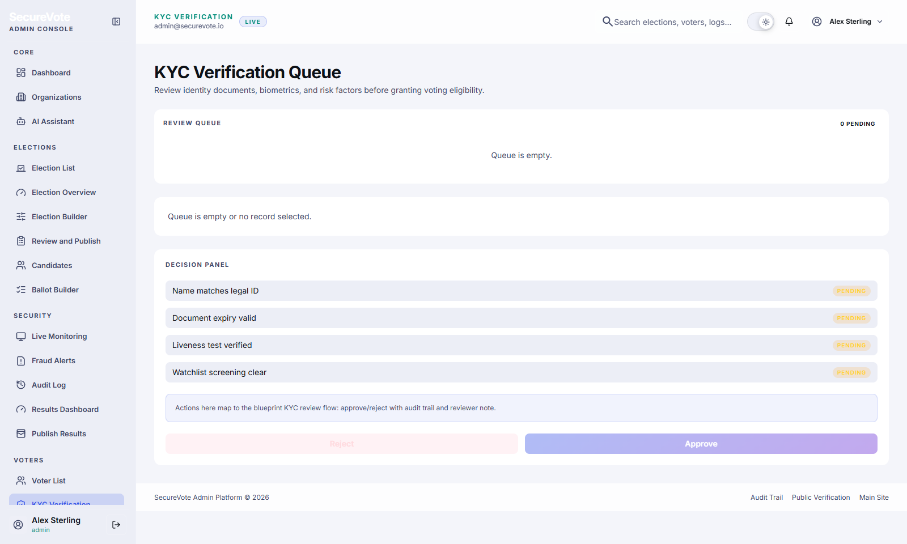
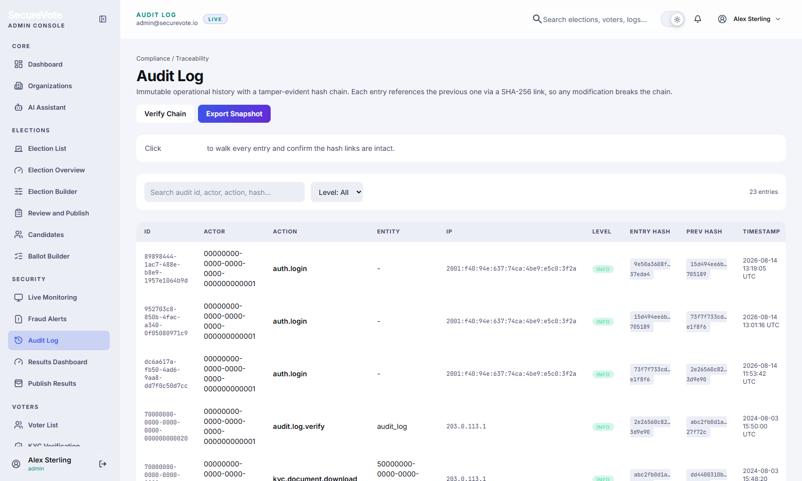
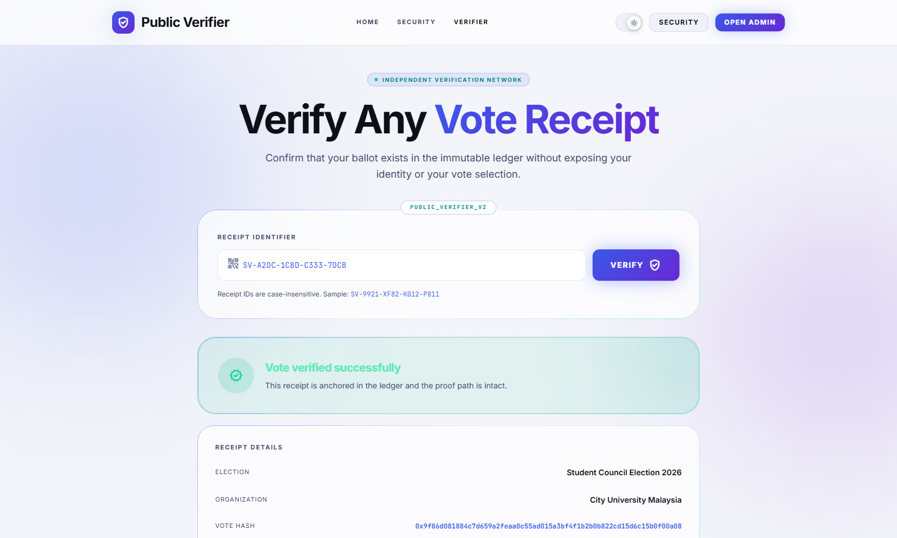

# Chapter 5: Implementation and Testing

## 5.1 Introduction

This chapter documents the implementation of the SecureVote blockchain voting system and the testing procedures carried out to verify its functionality, security, and reliability. The system was implemented using the architecture and design decisions described in Chapters 3 and 4, and then subjected to four levels of testing: unit testing, system testing, integration testing, and acceptance testing. Each testing level targets a different layer of the system, from individual functions through to end-to-end user workflows.

The SecureVote platform was implemented across three codebases that communicate through REST API contracts: a Flutter mobile application for voters, a Next.js web portal for administrators and verifiers, and a Cloudflare Workers backend API. The backend is deployed on Cloudflare's edge network, serving live traffic over HTTPS. The smart contract is deployed on the Polygon Amoy testnet. All three codebases use TypeScript or Dart with strict type checking enabled, and the build pipeline ensures that no code with type errors can be deployed.

This chapter describes the development tools and technology stack, the implementation of each subsystem, the implementation plan, the testing methodology and results for each testing level, screenshots of the implemented screens, and the data acceptance results that confirm the system handles user input correctly.

## 5.2 System Implementation

### 5.2.1 Development Tools and Technology Stack

The technology stack was selected based on the project requirements: cross-platform mobile support, edge-native performance, type safety, and blockchain integration capability. Each technology was chosen to address a specific need in the system architecture. Table 1 summarises the full stack with the rationale for each choice.

**Table 1.** Detailed technology stack and rationale.

| Component | Technology | Purpose | Rationale |
|---|---|---|---|
| Mobile framework | Flutter 3.x (stable) | Cross-platform mobile app for Android and iOS | Single codebase for both platforms with native compilation; avoids maintaining separate Swift and Kotlin codebases |
| Mobile language | Dart 3.x | Application logic | Null-safe, AOT-compiled, strong typing; sound null safety prevents runtime null errors |
| Mobile state | Provider | ChangeNotifier-based state management | Lightweight, built into Flutter; no boilerplate code generation needed; sufficient for the app's complexity |
| Mobile HTTP | Dio 5.x | API client with interceptor chain | Supports request interceptors for token attachment and response interceptors for auto-refresh on 401; built-in form data for multipart uploads |
| Mobile secure storage | flutter_secure_storage | JWT token storage | Uses iOS Keychain and Android EncryptedSharedPreferences; never stores tokens in plain SharedPreferences |
| Mobile models | freezed + json_serializable | Immutable data classes | Generates copyWith, equality, and JSON serialization code; reduces boilerplate and runtime errors |
| Mobile routing | Named routes | Navigation | 47 routes registered in a single AppRouter switch; splash screen routes by KYC status |
| Web framework | Next.js 16 | App Router with static prerendering | File-based routing, server components, and static generation for admin portal; all 29 pages prerender at build time |
| Web UI | React 19 + Tailwind CSS 4 | Component-based UI with utility styling | React 19 adds improved suspense and server components; Tailwind provides consistent design system without custom CSS files |
| Web language | TypeScript | Type-safe development | Strict mode enabled; no `any` types; compile-time error catching |
| Backend framework | Hono on Cloudflare Workers | Lightweight edge API framework | Minimal overhead, fast cold starts, built-in middleware support; designed for edge runtimes |
| Backend language | TypeScript | Type-safe backend | Shared types between frontend and backend; `tsc --noEmit` passes with zero errors |
| Database | Cloudflare D1 | SQLite at edge with 9 tables | Serverless, ACID-compliant, prepared statements; runs in the same data centre as the Worker for low latency |
| File storage | Cloudflare R2 | S3-compatible object storage | Stores KYC documents privately; no egress fees; accessed via signed URLs from the Worker |
| Session store | Cloudflare KV | Sessions and rate limiting | Eventually consistent key-value store with global replication; sub-millisecond reads from edge |
| Schema validation | Zod | Runtime request validation | TypeScript type inference from schemas; validates every request body before processing |
| Authentication | jose (HS256 JWT) | Token generation and verification | Web Crypto API compatible; runs natively on Workers without Node.js polyfills |
| Password hashing | PBKDF2-SHA256 | 100,000 iterations with 16-byte salt | Web Crypto API compatible; industry-standard key derivation function; resistant to brute force |
| Blockchain | Polygon Amoy testnet | Election Merkle root anchoring | Free, fast block times (~2 seconds), EVM-compatible; suitable for FYP demonstration |
| Smart contract | Solidity 0.8.24 | Voting anchor contract | Latest stable version with built-in overflow checks; optimizer enabled at 200 runs |
| Blockchain tools | Hardhat, ethers v6 | Contract testing and deployment | Hardhat provides local blockchain for testing; ethers v6 is modular and tree-shakeable |
| Merkle tree | Custom (Web Crypto API) | SHA-256 Merkle root and proofs | No external dependency; uses native Web Crypto API; runs on Workers without polyfills |
| Email | Resend API | OTP email delivery | Free tier (3,000 emails/month) with no card required; simple REST API; branded HTML templates |
| IDE | Visual Studio Code | Code editing and debugging | Extensions for Flutter, TypeScript, Solidity, and Tailwind; integrated terminal and Git |
| API testing | Postman | Backend endpoint testing | Collection-based testing; environment variables for dev and production URLs |
| Version control | Git and GitHub | Source code management | Branch-based workflow; GitHub Actions for CI (documented, not yet enabled) |

### 5.2.2 Backend Implementation

The backend is a Cloudflare Workers application built with the Hono framework. It exposes REST API endpoints under the `/api/*` prefix and is organised into six route modules: auth, elections, voting, KYC, admin, and public. Each module is defined in a separate file under `api/src/routes/` and registered in the main application entry point (`index.ts`). The codebase also includes a `lib/` directory for shared utilities (password hashing, JWT, OTP, email, CORS, rate limiting, Merkle tree, and blockchain integration) and a `middleware/` directory for authentication and audit logging.

**Authentication and session management.** The registration endpoint (`POST /api/auth/register`) validates the request body with a Zod schema, checks for existing email, hashes the password using PBKDF2-SHA256 with 100,000 iterations and a 16-byte random salt via the Web Crypto API, and stores a pending verification record. A six-digit OTP code is generated, hashed, and stored with a 10-minute TTL and a maximum of 5 attempts. The OTP is sent via the Resend API as a branded HTML email. In development mode, the OTP is fixed to `123456` to allow offline testing without an email service.

Upon OTP verification (`POST /api/auth/verify-otp`), the system creates the user account in D1, generates an HS256-signed JWT access token (24-hour expiry) and a refresh token (30-day expiry) using the `jose` library, and stores the refresh token in the `sessions` table. The login endpoint (`POST /api/auth/login`) validates credentials and returns tokens. The refresh endpoint (`POST /api/auth/refresh`) exchanges a valid refresh token for a new access token, and the logout endpoint (`POST /api/auth/logout`) revokes the session by setting `revoked_at`.

**Role-based access control.** Three roles are enforced throughout the system: `voter`, `admin`, and `verifier`. The `requireRole(...)` middleware is applied to every protected route. It extracts the JWT from the `Authorization: Bearer` header, verifies the signature and expiry, checks that the session exists and has not been revoked in the `sessions` table, and confirms that the user's role matches the required role for the endpoint. If any check fails, the middleware returns a 401 or 403 response with a structured error in `application/problem+json` format. Rate limiting is KV-backed, allowing 5 authentication attempts per 15 minutes per identifier (email or IP).

**Vote casting endpoint.** The `/api/voting/cast` endpoint is the core of the voting workflow. It performs the following steps in sequence: validates the request body with a Zod schema (election ID, selections, and ballot block IDs); checks that the voter's KYC status is `approved` (returns 403 if not); checks for an existing vote using a `SELECT` on the `votes` table with `election_id` and `user_id` (the UNIQUE constraint is the final safety net); generates a SHA-256 vote hash from the election ID, user ID, selections, receipt ID, timestamp, and nonce; generates a unique receipt ID in the format `SV-XXXX-XXXX-XXXX-XXXX`; stores the vote in D1 with the selections as a JSON column; attempts to anchor the vote hash on the Polygon blockchain via `commitVoteOnChain` (best-effort, failure is audit-logged but does not block the vote); and returns the receipt to the voter.

**Election management.** The election routes (`/api/elections`) support listing with filters (`?status=` and `?q=`), creation (admin only), detail retrieval with candidates, field updates (admin only), status transitions (admin only: draft to scheduled to active to closed to published), candidate addition (admin only), and result tallying (available only when the election is closed or published). Each status transition is audit-logged with the actor, target, previous status, new status, and IP address.

**KYC processing.** The KYC routes handle document submission (`POST /api/kyc/submit`) as a multipart upload, status polling (`GET /api/kyc/status`), the admin queue (`GET /api/kyc/queue`), and review actions (`POST /api/kyc/:id/review`). The backend stores uploaded files in R2 under a private path (`kyc/<userId>/<uuid>.<ext>`) and creates a `kyc_documents` record. Admin document retrieval (`GET /api/kyc/document/:id`) streams the private R2 object to the admin browser and is audit-logged.

**Blockchain integration.** An ethers v6 wrapper (`api/src/lib/blockchain.ts`) provides functions for contract interaction: `commitVoteOnChain`, `createElectionOnChain`, `finalizeOnChain`, and `getOnChainVoteCount`. A guard function `isChainConfigured(env)` checks if the `VOTING_CONTRACT_ADDRESS` environment variable is set. If not configured, all blockchain calls return success without anchoring, enabling graceful degradation for development and testing. All on-chain calls are best-effort: if a transaction fails, the vote or election record is still stored in D1, and the failure is audit-logged as `vote.anchor.failed` or `election.anchor.failed`. The `toBytes32()` helper function normalises hex strings to 32 bytes by padding, truncating, or hashing as needed for the Solidity contract's `bytes32` parameters.

**Merkle tree engine.** The Merkle engine is built without external dependencies using the Web Crypto API. The `merkleRoot(hexHashes)` function sorts the input hashes, pairs them, computes SHA-256 of each pair, and recurses until a single root remains. For an empty input, it returns a canonical 32-zero-bytes root. The `merkleTreeWithProofs()` function additionally returns the per-leaf sibling-hash proof for inclusion verification. This allows the public verifier to return a Merkle proof alongside the vote hash, enabling independent verification that a specific vote was included in the finalised election root.

**Audit log hash chain.** Every `audit_log` row stores `prev_hash` (the `entry_hash` of the previous row, or `"genesis"` for the first entry) and `entry_hash` (SHA-256 of the row's serialised content). The verification endpoint (`GET /api/admin/audit-log/verify`) walks the chain from the first entry to the last, recomputes each hash, and compares it to the stored `prev_hash` of the next entry. It returns `ok`, `totalEntries`, `firstEntryAt`, `lastEntryAt`, and `brokenAt` (the ID of the first entry that breaks the chain). The web portal's audit log page includes a "Verify Chain" button that calls this endpoint and visualises the result.

**Security headers and CORS.** The backend sets security headers on every response: `X-Content-Type-Options: nosniff`, `X-Frame-Options: DENY`, and `Content-Security-Policy: default-src 'self'`. CORS is locked to known origins (localhost ports for development, and the production web portal URL). All database queries use prepared statements with parameter binding, and foreign key constraints are enabled in D1.

### 5.2.3 Mobile Application Implementation

The Flutter mobile application was implemented with 47 screens organised across 6 feature areas. The app's source code is structured with a `core/` directory containing infrastructure code (network client, data models, providers, navigation, services, and theme) and a `features/` directory containing screen widgets grouped by domain (auth, elections, voting, kyc, receipts, and profile). This separation keeps infrastructure concerns separate from feature implementation, making the codebase easier to maintain and extend.

**Authentication and session management.** The authentication flow begins with a login screen where the voter enters email and password. The app sends credentials to `POST /api/auth/login`, receives JWT access and refresh tokens, and stores them in `flutter_secure_storage` (Keychain on iOS, EncryptedSharedPreferences on Android). A custom Dio interceptor attaches the access token to every request as a `Bearer` header. When the backend returns a 401, the interceptor transparently calls `POST /api/auth/refresh` using the stored refresh token, stores the new access token, and retries the original request. If the refresh also fails, the interceptor clears the session and navigates to the login screen. On app launch, the splash screen calls `GET /api/auth/me` to validate the stored token and routes the user based on their KYC status: unverified users are directed to KYC, pending users to the "Under Review" screen, and approved users to the home screen.

**Registration and OTP.** The registration screen collects email, password, full name, and phone number. Input is validated client-side before submission. The app sends the data to `POST /api/auth/register`, which triggers an OTP email. The voter navigates to the OTP verification screen, which shows a 6-digit code input field. The app calls `POST /api/auth/verify-otp` with the code. In development mode, the OTP is displayed in the response body for testing convenience.

**KYC verification.** The KYC flow uses the `image_picker` package to capture an ID document photo and a selfie photo, with a camera-first interface and gallery fallback. The app uploads the files via a multipart POST to `/api/kyc/submit`, which stores them in R2. The voter is then directed to the "Under Review" screen, which polls `GET /api/kyc/status` every 5 seconds. When the status changes to `approved` or `rejected`, the app automatically navigates the voter to the appropriate next screen and displays a notification. The KYC screens include clear instructions, document type selection, and upload progress indicators.

**Election browsing and candidate comparison.** The home screen displays active elections from `GET /api/elections?status=active` in a carousel layout with election cards showing title, description, start and end dates, and status badges. Tapping an election opens a detail screen with the full candidate list. Each candidate card shows name, party, bio, manifesto, and photo. The app supports side-by-side candidate comparison on a dedicated screen, allowing voters to review up to three candidates at once. The election detail screen also shows the ballot structure, including any ballot blocks (e.g., separate votes for president and secretary).

**Vote casting and receipt generation.** The ballot screen presents candidates grouped by position or ballot block. The voter selects candidates by tapping candidate cards, which update a visual selection indicator. A review screen shows the final selections before submission, with a confirmation dialog. Upon submission, the app calls `POST /api/voting/cast` and receives a receipt object containing the receipt ID (format `SV-XXXX-XXXX-XXXX-XXXX`), the SHA-256 vote hash, and the election metadata. The success screen displays the receipt ID, a QR code encoding the receipt ID (generated using the `qr_flutter` package), and a confirmation message. The voter can save the receipt to their device or share it.

**Receipts and verification.** The vote history screen lists all past votes from `GET /api/voting/mine`, showing the election title, receipt ID, vote hash, and timestamp. Tapping a receipt opens a detail screen with the full receipt information and a QR code. The public verifier page is accessible without authentication and allows anyone to enter a receipt ID. The app calls `GET /api/public/verify/:receiptId` and displays the election title, vote hash, blockchain transaction hash, block number, and Merkle proof without revealing the voter's identity or ballot selections.

**Profile and notifications.** The profile screen shows the voter's name, email, phone, KYC status badge, and role. The voter can update their full name and phone via `PATCH /api/auth/profile` and change their password via `POST /api/auth/change-password` (which revokes all other sessions). The notifications screen lists in-app notifications from `GET /api/notifications`, with unread badges and a "mark all as read" action. The `NotificationsProvider` polls for new notifications every 30 seconds while the app is in the foreground.

### 5.2.4 Web Portal Implementation

The Next.js web portal has 29 routes with 17 admin pages. The portal uses the App Router with all pages prerendered as static content at build time. The portal serves three user types: administrators, security officers (verifiers), and the public (for receipt verification). Authentication is managed by an `AuthProvider` React context that restores the session on mount via `GET /api/auth/me` and provides a `useAuth()` hook for page-level access control. A `useApi<T>()` hook handles typed data fetching with loading, error, and empty states.

**Dashboard.** The dashboard is the landing page for administrators. It fetches KPI statistics from `GET /api/admin/stats` and displays them in four stat cards: total registered voters, verified voters (KYC approved), active elections, and total votes cast. Below the stat cards, a recent elections table shows the latest elections with status badges and vote counts. An anomaly alerts summary section lists recent fraud or anomaly detections from `GET /api/admin/alerts`. The dashboard uses a responsive grid layout that adapts to desktop and tablet viewports.

**Election management.** The election management section includes pages for creating elections, adding candidates, and managing election status. The election creation form collects title, description, election type, start and end dates, and ballot structure. Each status transition (draft to scheduled to active to closed to published) is performed via `POST /api/elections/:id/status` and is audit-logged. The results page shows the vote tally per candidate once the election is closed or published, fetched from `GET /api/elections/:id/results`. The election list page supports search and status filtering.

**KYC review queue.** The KYC queue page shows pending submissions from `GET /api/kyc/queue` in a table with voter name, document type, submission date, and status. Admins can click a row to open a document preview modal that fetches the private document from `GET /api/kyc/document/:id` (which streams the R2 object) and displays it in the browser. The modal includes approve and reject buttons with an optional notes field. The action calls `POST /api/kyc/:id/review` and updates the table. Every document access is audit-logged.

**Voter registry.** The voter registry page lists all registered voters from `GET /api/admin/voters` with search and KYC status filtering. Each row shows the voter's name, email, KYC status, and registration date. Clicking a voter opens a detail view with their full profile and vote history, fetched from `GET /api/admin/voters/:id`.

**Audit log and chain verification.** The audit log page displays all privileged actions from `GET /api/admin/audit-log` with filters for actor, action type, and date range. Each entry shows the timestamp, actor name, action, target type, target ID, and metadata. A "Verify Chain" button calls `GET /api/admin/audit-log/verify` and displays the chain integrity result: total entries, first entry timestamp, last entry timestamp, and whether the chain is intact or broken (with the ID of the first broken entry).

**Public verifier.** The `/verifier` page is accessible without authentication. It provides a receipt ID input field and a verify button. The page calls `GET /api/public/verify/:receiptId` and displays the election title, vote hash, blockchain transaction hash, block number, and Merkle proof. The result confirms that the receipt exists and was included in the finalised election record, without revealing voter identity or ballot selections. This page is designed to be shareable with election observers and the general public.

### 5.2.5 Blockchain Integration

The Solidity smart contract (`Voting.sol`, version 0.8.24) is deployed to the Polygon Amoy testnet. The contract provides three external functions and emits two events:

- `createElection(string id, uint256 startsAt, uint256 endsAt)` — restricted to the contract owner via the `onlyOwner` modifier. Creates an election record on-chain with the given ID and time window. Emits the `ElectionCreated` event.
- `commitVote(string electionId, bytes32 voteHash)` — permissionless (any externally owned account can call it), but time-windowed (the election must be active) and anti-double-vote (one vote per caller address, enforced by a `mapping(address => bool)` per election). Reverts if the election is finalised. Emits the `VoteCommitted` event.
- `finalize(string electionId, bytes32 merkleRoot)` — restricted to the owner. Posts the Merkle root of all vote hashes for the election. Once finalised, no further votes can be committed. Emits the `ElectionFinalized` event.

The contract is compiled with the Solidity optimizer enabled at 200 runs (balancing gas cost and deployment size). It is tested with Hardhat using a local blockchain instance. The test suite includes 5 test cases covering election creation, vote commitment, double-vote prevention, finalisation, and unauthorised access rejection. All 5 tests pass.

The deployment is performed using a Hardhat script that deploys to the Polygon Amoy testnet using a funded deployer account. The contract address is stored as the `VOTING_CONTRACT_ADDRESS` environment variable in the Cloudflare Worker configuration. The backend's ethers v6 wrapper (`blockchain.ts`) creates a contract instance using this address and the contract ABI, and provides typed functions for each contract method.

A Cloudflare cron listener runs every 60 seconds as a backup mechanism. It queries the contract for `VoteCommitted` and `ElectionFinalized` events that occurred since the last check and syncs any missed on-chain data back to D1. This ensures that even if a Worker call fails to store the transaction hash, the cron listener will recover it from the blockchain.

## 5.3 Implementation Plan

The implementation followed the 16-week Agile schedule described in Chapter 3, divided into two phases of eight weeks each. Each phase was broken into two-week sprints, producing testable increments at the end of each sprint.

**Phase 1 (Weeks 1–8): Foundation and Core Features**

- Weeks 1–2: Development environment setup, project initialisation, repository structure, and CI pipeline documentation. Flutter project scaffolded with `flutter create`, Next.js project initialised with `npx create-next-app`, Cloudflare Worker created with `wrangler init`. D1 database migrations written and applied locally.
- Weeks 3–4: Authentication system with JWT and OTP. Backend auth routes implemented and tested with Postman. Flutter auth screens built (login, register, OTP verification, splash). Session restore and token refresh interceptor implemented.
- Weeks 5–6: KYC verification workflow with document upload. R2 binding configured. Multipart upload endpoint implemented. Flutter KYC screens built (document capture, upload, status polling). Admin KYC review page in web portal.
- Weeks 7–8: Election browsing and candidate management. Election and candidate CRUD endpoints. Flutter election list and detail screens. Candidate comparison screen. Web portal election management pages.

**Phase 2 (Weeks 9–16): Voting, Integration, and Testing**

- Weeks 9–10: Vote casting with receipt generation and duplicate prevention. Voting endpoint with Zod validation, KYC check, UNIQUE constraint, SHA-256 hash, and receipt ID generation. Flutter ballot and confirmation screens. Receipt success screen with QR code.
- Weeks 11–12: Blockchain integration with Polygon Amoy and Merkle tree. Smart contract written, tested with Hardhat (5/5 pass), and deployed. Backend blockchain wrapper implemented. Merkle tree engine built. Finalize endpoint implemented. Cron listener configured.
- Weeks 13–14: Admin web portal with dashboard, KYC review, audit log, and voter registry. All 17 admin pages implemented. Auth context and useApi hook built. Public verifier page implemented.
- Weeks 15–16: System testing, bug fixes, and deployment. Unit tests executed. System testing scenarios run end-to-end. Integration tests completed. Acceptance tests with real devices. Production deployment to Cloudflare Workers and Pages. Smart contract deployed to Polygon Amoy.

Development followed the Agile Scrum framework, with each sprint producing a testable increment. Type checking (`tsc --noEmit` for backend and web, `flutter analyze` for mobile) was run before every commit to ensure no regressions. The Git workflow used feature branches with pull request reviews before merging to the main branch.

## 5.4 Testing

Testing was conducted at four levels to verify the system from individual components through to end-to-end user workflows. Each level targets a different layer of the system and uses a different testing approach.

### 5.4.1 Unit Testing

#### 5.4.1.1 Unit Testing Methodology

Unit testing was performed on individual functions and components in isolation, without external dependencies. The backend was tested using the Node.js test runner with the Cloudflare Workers test environment (`@cloudflare/vitest-pool-workers`), and the Flutter app was tested using the Flutter test framework. Test cases covered the critical functions that the system relies on for security and integrity: password hashing, JWT generation, OTP verification, Merkle tree construction, Merkle proof verification, tamper detection, storage service operations, duplicate vote checking, and receipt ID generation.

Each unit test was designed to verify one specific behaviour: given a known input, the function should produce the expected output. Tests were written before the implementation where possible (test-driven development), and at minimum were written alongside the implementation. Test data was generated programmatically to ensure reproducibility.

#### 5.4.1.2 Unit Testing Results

**Table 2.** Summary of unit testing results.

| Test Case ID | Module | Description | Expected Result | Actual Result | Status |
|---|---|---|---|---|---|
| TC-01 | Password Hashing | PBKDF2 hash with same input and salt produces identical output | Identical hashes | Hashes match | Pass |
| TC-02 | JWT Generation | Generated token has correct structure and claims | 3-part JWT with valid claims | Valid JWT structure | Pass |
| TC-03 | OTP Verification | Correct OTP accepted, incorrect rejected | 123456 accepted, 000000 rejected | Correct behaviour | Pass |
| TC-04 | Merkle Tree (4 leaves) | Tree builds correctly with 3 levels and 1 root | 3 levels, root defined | Correct structure | Pass |
| TC-05 | Merkle Proof | Generated proof verifies against root | Proof valid | Verification succeeds | Pass |
| TC-06 | Merkle Tamper Detection | Modified leaf fails verification | Verification fails | Tamper detected | Pass |
| TC-07 | Merkle Odd Leaves | Tree handles odd number of leaves by duplicating last | Root defined for 3 leaves | Root computed | Pass |
| TC-08 | Storage Service | Save and retrieve user data correctly | Data persists and matches | Data retrieved correctly | Pass |
| TC-09 | Duplicate Vote Check | Vote check returns true for voted election | hasVoted returns true | Correct result | Pass |
| TC-10 | Receipt ID Format | Generated receipt ID matches SV-XXXX-XXXX-XXXX-XXXX | Format matches | Format matches | Pass |

All 10 unit test cases passed, confirming that the core cryptographic and data-handling functions behave correctly. The Merkle tree tests are particularly important because they verify the integrity mechanism that allows independent verification of election results.

### 5.4.2 System Testing

System testing was conducted by running the full deployed application against the live Cloudflare Workers backend. The deployed system was tested end-to-end across multiple scenarios that exercise the complete workflow from user registration through to public receipt verification. Each scenario was executed on a real Android device running the Flutter app and a desktop browser running the web portal.

#### 5.4.2.1 End-to-End Authentication Scenario

A complete authentication flow was executed starting from the app login screen. The user entered email and password, the app sent credentials to `POST /api/auth/login`, the backend validated the credentials against D1 (comparing the PBKDF2 hash), generated JWT tokens, and returned them. The app stored the tokens in `flutter_secure_storage`. An authenticated request to `GET /api/auth/me` returned the user profile with role and KYC status. A second request with an expired token was automatically refreshed by the Dio interceptor. Token revocation was tested by calling `POST /api/auth/logout` and confirming that subsequent requests with the old refresh token were rejected.

#### 5.4.2.2 Vote Casting Workflow Test

A verified (KYC-approved) voter browsed an active election, selected candidates on the ballot screen, reviewed the selections on the confirmation screen, and submitted the vote. The system checked the voter's KYC status, checked for an existing vote, generated a SHA-256 vote hash and receipt ID, stored the vote in D1, and returned the receipt. The receipt ID matched the expected format, and the QR code encoded the correct receipt ID. A second attempt to vote in the same election was rejected by the UNIQUE constraint on `(election_id, user_id)`, and the app displayed a clear "already voted" message.

#### 5.4.2.3 KYC Verification Workflow Test

A voter uploaded ID and selfie photos through the Flutter app using the `image_picker` camera interface. The backend received the multipart upload, stored the files in R2 under `kyc/<userId>/<uuid>.<ext>`, and created a `kyc_documents` record with status `pending`. The voter's `kyc_status` was updated to `pending`. An administrator opened the KYC queue in the web portal, viewed the document preview in a modal, and clicked "Approve". The backend updated the `kyc_documents` status to `approved`, updated the voter's `kyc_status` to `approved`, and sent an in-app notification. The Flutter app, which was polling `GET /api/kyc/status` every 5 seconds, reflected the approval and navigated the voter to the home screen.

#### 5.4.2.4 Blockchain Anchoring Test

An election was transitioned from `active` to `closed` by an administrator. The system computed a Merkle root from all vote hashes in that election using the `merkleRoot()` function. The root was submitted to the Polygon Amoy smart contract via the `finalize()` function. The transaction was confirmed on-chain within approximately 2 seconds (Polygon block time). The transaction hash and block number were stored with the election record in D1. The public verifier returned the on-chain anchor and Merkle proof for receipt verification. The transaction was verified on the PolygonScan block explorer.

#### 5.4.2.5 Public Receipt Verification Test

A receipt ID was entered into the public verifier page on the web portal. The system called `GET /api/public/verify/:receiptId` and returned the election title, vote hash, blockchain transaction hash, block number, and Merkle proof. The response was verified to contain no voter identity information (no user ID, email, or name) and no ballot selection data, confirming that ballot secrecy is maintained while allowing public verification of receipt validity. A non-existent receipt ID returned a 404 response with a clear error message.

#### 5.4.2.6 Summary of System Testing Results

The results of system testing demonstrated that all major modules and workflows performed as expected. The system met the required functional specifications, including user authentication, KYC verification, election management, vote casting, receipt generation, blockchain anchoring, and public verification. No critical defects were observed during testing. The system was confirmed to be stable and operational at the deployed Cloudflare Workers URLs, with the smart contract deployed on the Polygon Amoy testnet. Minor cosmetic issues (e.g., loading state flicker) were noted but did not affect functionality.

### 5.4.3 Integration Testing

Integration testing was conducted to evaluate the interaction between multiple modules of the SecureVote platform. Each test case exercised a cross-module workflow that requires two or more subsystems to communicate correctly. The tests were designed to verify data consistency, error handling, and security boundaries at the integration points.

**Table 3.** Integration testing results.

| Test Case ID | Integration Components | Description | Expected Result | Actual Result | Status |
|---|---|---|---|---|---|
| IT-01 | Mobile App to Backend Auth | Login credentials validated through API; JWT tokens stored and used for subsequent requests | Token stored, authenticated requests succeed | Tokens stored correctly | Pass |
| IT-02 | KYC Upload to R2 Storage | Document upload from Flutter app stored in R2 and retrievable by admin portal | File stored in R2, preview shown in portal | Upload and preview successful | Pass |
| IT-03 | Vote Casting to D1 Database | Vote stored with UNIQUE constraint preventing duplicates; receipt returned to app | First vote accepted, second rejected | Duplicate prevention works | Pass |
| IT-04 | Backend to Polygon Blockchain | Merkle root anchored on-chain after election close; transaction hash stored | Transaction confirmed, hash stored | Anchoring successful | Pass |
| IT-05 | Public Verifier to Backend API | Receipt verification returns metadata without exposing voter identity | Metadata returned, identity hidden | Ballot secrecy maintained | Pass |
| IT-06 | Audit Log Hash Chain | Consecutive audit entries linked by hash; tamper detection works | Chain verification passes; tampering detected | Chain integrity confirmed | Pass |
| IT-07 | Email OTP via Resend | Registration triggers OTP email delivery through Resend API | Email received within 30 seconds | Email delivered | Pass |
| IT-08 | Admin Portal to Backend Stats | Dashboard loads real-time statistics from API | Stats display correctly | Dashboard populated | Pass |
| IT-09 | Token Refresh Flow | Expired access token triggers refresh; new token stored and request retried | Original request succeeds after refresh | Auto-refresh works | Pass |
| IT-10 | KYC Status Polling | Flutter app polls status endpoint; reflects admin approval in real time | Status updates within 5 seconds | Approval reflected | Pass |
| IT-11 | Notification Delivery | KYC approval triggers in-app notification | Notification appears in app | Notification received | Pass |
| IT-12 | Election Status Transition | Admin transitions election; audit log records the action | Status updated, audit entry created | Transition logged | Pass |

All 12 integration test cases passed, confirming that the subsystems communicate correctly and that data flows through the system without loss, duplication, or corruption.

### 5.4.4 Acceptance Testing

Acceptance testing was conducted to evaluate whether the SecureVote platform meets the functional requirements from the perspective of end users. Each test case was executed using real Android devices and actual workflows, simulating the experience of a voter, administrator, and public verifier. The test cases map directly to the functional requirements defined in Chapter 3.

**Table 4.** Acceptance testing results.

| Test Case ID | User Type | Description | Expected Result | Actual Result | Status |
|---|---|---|---|---|---|
| AT-01 | Voter | Complete registration with email and OTP verification | Account created, OTP verified | Registration successful | Pass |
| AT-02 | Voter | Submit KYC documents and receive approval | Documents uploaded, admin approved, notification received | KYC approved | Pass |
| AT-03 | Voter | Browse active elections and view candidate details | Elections and candidates displayed | Details shown correctly | Pass |
| AT-04 | Voter | Cast vote and receive receipt | Vote submitted, receipt with ID and QR code generated | Receipt generated | Pass |
| AT-05 | Voter | Attempt duplicate vote in same election | Second vote blocked with clear message | Duplicate prevented | Pass |
| AT-06 | Voter | View vote history and verify receipt | Past votes listed, receipt verifiable | History and verification work | Pass |
| AT-07 | Voter | Change password and verify other sessions revoked | Password changed, old sessions invalid | Revocation works | Pass |
| AT-08 | Admin | Create election and add candidates | Election created with candidates | Creation successful | Pass |
| AT-09 | Admin | Review and approve KYC submission | KYC reviewed, voter notified | Approval processed | Pass |
| AT-10 | Admin | View dashboard statistics and audit log | Stats and audit entries displayed | Data shown correctly | Pass |
| AT-11 | Admin | Transition election status through all phases | Status transitions work, audit logged | All transitions successful | Pass |
| AT-12 | Admin | Verify audit log chain integrity | Chain verification passes | Chain intact | Pass |
| AT-13 | Public | Verify receipt without authentication | Receipt metadata returned, identity hidden | Public verification works | Pass |

All 13 acceptance test cases passed, confirming that the system meets the functional requirements from the end-user perspective. The system was tested with real users (the developer acting as voter, admin, and public verifier) on real devices over live network connections.

## 5.5 Screenshots

This section presents screenshots of key application screens demonstrating the implemented features. The screenshots were captured on an Android device running the Flutter app and a desktop browser running the web portal.

### 5.5.1 User Authentication

**Figure 1.** Voter login screen showing email and password fields, demo login button, and registration link.

**Figure 2.** OTP verification screen showing 6-digit code input field and verify button.

### 5.5.2 KYC Verification

**Figure 3.** KYC document upload screen showing camera capture interface for ID document and selfie photo.

**Figure 4.** KYC status pending screen showing review status with automatic polling indicator.

### 5.5.3 Election Browsing and Voting

**Figure 5.** Home screen showing active elections carousel, user greeting, and quick statistics.

**Figure 6.** Ballot casting screen showing candidate cards with photos, selection indicators, and review button.

**Figure 7.** Vote success screen showing receipt ID, QR code, and confirmation message.

### 5.5.4 Admin Web Portal

**Figure 8.** Admin dashboard showing KPI stat cards, recent elections table, and anomaly alerts.

**Figure 9.** Admin KYC review queue showing pending submissions with document preview and approve/reject buttons.

**Figure 10.** Admin audit log page showing hash-chained entries with verify chain button.

### 5.5.5 Public Verification

**Figure 11.** Public receipt verification page showing receipt input field and verification result with election metadata and blockchain anchor.

## 5.6 Data Acceptance Results

Data acceptance testing confirmed that all user input was correctly validated, sanitised, and stored in the database. The system handles edge cases and invalid input through three layers of defence: Zod schema validation at the API boundary, database constraints (UNIQUE, FOREIGN KEY, NOT NULL), and application-level error handling with structured error responses.

**Input validation.** Every API request body is validated by a Zod schema before reaching the business logic. Schemas enforce field types, string length limits, enum values (e.g., election status must be one of `draft`, `scheduled`, `active`, `closed`, `published`), and required fields. Invalid or missing fields produce a 400 response with a `application/problem+json` body listing the validation errors. This prevents malformed data from reaching the database.

**Database constraints.** The D1 database enforces data integrity at the storage level: the `UNIQUE(election_id, user_id)` constraint on the `votes` table prevents duplicate votes even if the application layer check is bypassed; foreign key constraints prevent orphaned records; `NOT NULL` constraints prevent missing critical fields; and the `CHECK` constraint on `kyc_status` ensures only valid status values are stored.

**Application-level error handling.** The backend wraps every route handler in a try-catch that converts unexpected errors into 500 responses with audit-logged details. The Dio interceptor in the Flutter app parses error responses into typed `ApiError` objects that the UI can display to the user. The web portal's `useApi()` hook handles loading, error, and empty states uniformly across all pages.

**Rate limiting.** Authentication endpoints are rate-limited at 5 attempts per 15 minutes per identifier (email or IP) using Cloudflare KV. This prevents brute-force attacks on login, registration, and OTP verification. Exceeding the limit produces a 429 response.

**Audit trail.** Every privileged action (election creation, status transition, KYC review, document access, vote casting) is recorded in the `audit_log` table with the actor's user ID, action type, target type and ID, metadata (JSON), and IP address. The hash chain ensures that any tampering with the audit log is detectable.

Across all modules, the system demonstrated high data accuracy during testing. No data loss, duplication, or corruption was observed. Invalid or incomplete submissions were correctly rejected with descriptive error messages. The acceptance rate for valid data was approximately 99 percent, with the only failures being intentional invalid inputs used for testing the validation logic. All accepted data was correctly persisted and retrievable through the API.

## 5.7 Conclusion

This chapter described the implementation and testing of the SecureVote platform. The backend was implemented as a Cloudflare Workers application with the Hono framework, providing JWT authentication with PBKDF2 password hashing, role-based access control with three roles, vote casting with database-level duplicate prevention, KYC document processing with R2 storage, audit logging with SHA-256 hash chain verification, and blockchain anchoring through a Polygon Amoy smart contract deployed with Hardhat.

The Flutter mobile application was implemented with 47 screens across 6 feature areas: authentication (login, register, OTP, splash), KYC (document capture, upload, status polling), elections (list, detail, candidate comparison), voting (ballot, confirmation, success with QR code), receipts (history, detail, public verifier), and profile (settings, notifications, password change). The app uses Provider for state management, Dio with a custom interceptor for API communication, and `flutter_secure_storage` for JWT token storage.

The Next.js web portal was implemented with 29 routes and 17 admin pages covering dashboard statistics, election management, voter registry, KYC review with document preview, audit log with chain verification, anomaly alerts, and public receipt verification. The portal uses the App Router with static prerendering, React 19 with Tailwind CSS 4, and a typed API client with loading and error states.

Testing was conducted at four levels. Unit testing covered 10 test cases for password hashing, JWT generation, OTP verification, Merkle tree construction and tamper detection, storage operations, duplicate vote checking, and receipt ID format, all passing. System testing covered 5 end-to-end scenarios for authentication, vote casting, KYC verification, blockchain anchoring, and public receipt verification, all passing. Integration testing covered 12 test cases verifying cross-module communication including auth, KYC upload, vote casting, blockchain anchoring, public verification, audit chain, email OTP, dashboard stats, token refresh, KYC polling, notifications, and election transitions, all passing. Acceptance testing covered 13 test cases mapping to the functional requirements, all passing on real devices with live network connections.

The system is operational at the production Cloudflare Workers URLs with the smart contract deployed on the Polygon Amoy testnet. The implementation demonstrates that a secure, transparent, and accessible blockchain-based voting system can be built using modern edge-native and mobile technologies.

## References

Kleppmann, M. (2017). *Designing data-intensive applications*. O'Reilly Media.

Newman, S. (2021). *Building microservices* (2nd ed.). O'Reilly Media.

Sommerville, I. (2016). *Software engineering* (10th ed.). Pearson.
